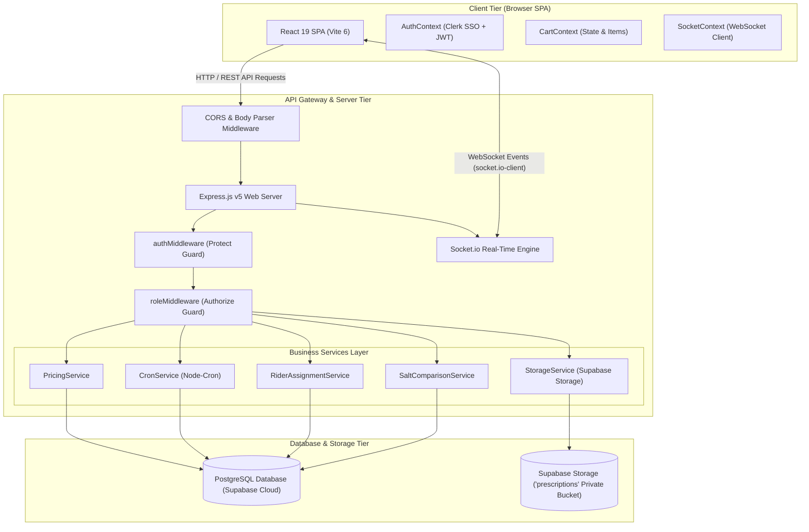
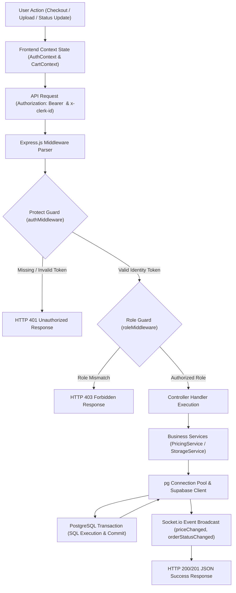
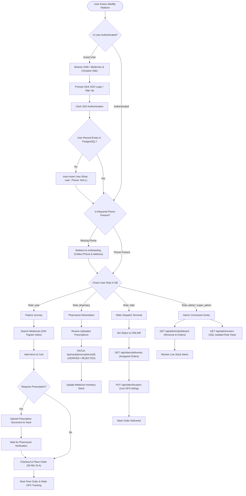
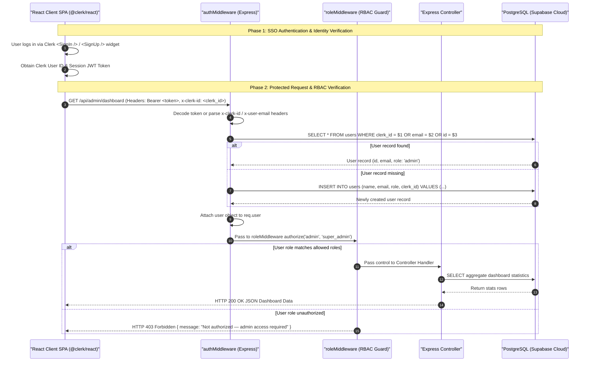
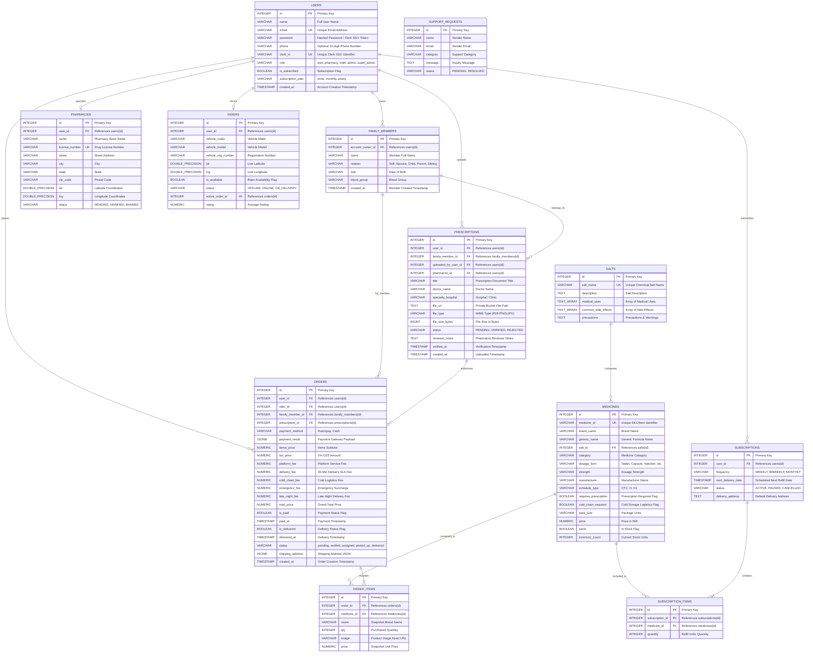

# 🚀 Medifly

**Enterprise-Grade Emergency Healthcare Delivery & Automated Prescription Refill Platform**

[](https://nodejs.org/)
[](https://expressjs.com/)
[](https://react.dev/)
[](https://vitejs.dev/)
[](https://clerk.com/)
[](https://supabase.com/)
[](https://socket.io/)
[](backend/scripts/testCrossAccountIsolation.js)
[](LICENSE)

> **Medifly** is an enterprise-grade, real-time emergency healthcare delivery & prescription auto-refill platform built on Node.js **Express v5**, **React 19**, **Vite 6**, **Clerk Authentication & Multi-Tenancy**, and **PostgreSQL (Supabase Cloud)**. Medifly hosts over **254,023 authentic medicines** and **11,850 bioequivalent chemical salts**, featuring **30-Minute Ultra-Express Delivery**, `pg_trgm` GIN trigram indexed SQL search, a bioequivalent salt comparison engine (saving up to 70% on generics), cold-chain insulated logistics, automated subscription refills (`node-cron`), a family prescription vault with 10-minute signed file URLs, and role-based access portals for Patients, Pharmacists, Delivery Riders, and System Administrators.

---

## 🌐 Live Demo & Credentials

- **Live Backend API**: [https://medifly-api.onrender.com](https://medifly-api.onrender.com)
- **API Health Check**: `GET https://medifly-api.onrender.com/health`
- **GitHub Repository**: [https://github.com/em-srs/Medifly](https://github.com/em-srs/Medifly)

### Demo Credentials & Portal Roles

| Portal / Role | Email Address | Password | Permissions & Scope |
| :--- | :--- | :--- | :--- |
| **Regular Patient (`user`)** | `user@medifly.com` | `user123` | Search 254k+ meds, Cart, 30-Min Express SLA, Family Vault, Orders, Auto-Refill |
| **Pharmacist (`pharmacy`)** | `pharma@medifly.com` | `pharma123` | Pharmacy Workstation, Prescription Document Review (`VERIFIED`/`REJECTED`), Inventory Updates |
| **Fleet Rider (`rider`)** | `rider@medifly.com` | `rider123` | Fleet Dispatch Terminal, Live GPS Location Updates (`lat`/`lng`), Active Order Deliveries |
| **System Admin (`admin`)** | `admin@medifly.com` | `admin123` | Admin Command Center, PostgreSQL Revenue Analytics, System Overrides, Low-Stock Alerts |
| **Super Admin (`super_admin`)** | `superadmin@medifly.com`| `superadmin123`| Full System Governance, Executive Dashboard, Super Admin Management (SQL Isolated) |

---

## ✨ Key Features

### 👤 Patient Portal (`user`)
- **254k+ Medicine Dataset**: Sub-millisecond SQL search using `pg_trgm` GIN trigram indexing across brand names, generic formulas, and manufacturers.
- **Salt Comparison Engine**: Bioequivalent chemical matching (`compareSalts`) displaying generic alternatives sorted ascending by price (up to 70% cheaper).
- **30-Minute Ultra-Express SLA**: Dynamic multi-tier pricing (`PricingService`) calculating GST, platform fee, cold-chain handling, emergency surcharges, and late-night waivers.
- **Prescription Vault**: Multi-profile family records (`Self`, `Spouse`, `Child`, `Parent`), signed 10-minute file URLs, and server-side ownership security (`account_owner_id`).
- **Auto-Refill Subscriptions**: Scheduled recurring deliveries (`WEEKLY`, `BIWEEKLY`, `MONTHLY`) executed via daily background cron runner (`CronService`).

### 🩺 Pharmacist Workstation (`pharmacy`)
- **Prescription Document Verification**: Review terminal to inspect patient uploads and update prescription status (`PENDING` -> `VERIFIED` or `REJECTED`) with reviewer notes.
- **Inventory & Stock Management**: Modify medicine prices and inventory stock counts with instant WebSockets broadcast (`priceChanged`, `inventoryChanged`).

### 🛵 Fleet Rider Terminal (`rider`)
- **Live Dispatch Terminal**: Fetch assigned delivery orders (`GET /api/riders/deliveries`) and toggle availability status (`OFFLINE` -> `ONLINE` -> `ON_DELIVERY`).
- **Real-Time GPS Tracking**: Stream live latitude/longitude coordinates (`PUT /api/riders/location`) directly to patient tracking screens via WebSockets.

### 🛡️ Admin Command Center (`admin` & `super_admin`)
- **Real-Time PostgreSQL Analytics**: Aggregate statistics for total revenue, total orders, active user count, and automated low-stock warnings (`inventory_count < 10`).
- **SQL-Level Role Isolation**: `admin` accounts query system users via SQL filters excluding `super_admin` records (`WHERE role != 'super_admin'`) to enforce governance hierarchy.

---

## 🏛️ Architecture & System Diagrams

### 1. High-Level Architecture

```
+-----------------------------------------------------------------------------------+
|                                 CLIENT TIER                                       |
|  React 19 SPA (Vite 6) + React Router v7 + Clerk SSO (@clerk/react) + Lucide      |
|  Context Providers: AuthContext | CartContext | SocketContext (socket.io-client) |
+-----------------------------------------------------------------------------------+
                                         |
                            HTTP REST API & WebSockets
                                         |
+-----------------------------------------------------------------------------------+
|                             API GATEWAY & SERVER TIER                             |
|  Node.js + Express v5 Web Application Server                                      |
|  Middlewares: authMiddleware (Clerk/JWT Protect) | roleMiddleware (RBAC Guard)    |
|  Services: PricingService | CronService | RiderAssignment | StorageService        |
|  WebSockets Engine: Socket.io Event Dispatcher & Room Manager                     |
+-----------------------------------------------------------------------------------+
                                         |
                                Database Queries & Storage
                                         |
+-----------------------------------------------------------------------------------+
|                            DATABASE & STORAGE TIER                                |
|  PostgreSQL Database on Supabase Cloud (pg Pool, 254k+ Meds, GIN Trigram Index)  |
|  Supabase Storage (Private 'prescriptions' Bucket + 10-Min Signed File URLs)     |
+-----------------------------------------------------------------------------------+
```



---

### 2. System Data Flow Diagram



---

### 3. User Flow & Journey Flowchart



---

### 4. JWT Authentication & RBAC Sequence Diagram



---

## 📂 Project Structure

```
medifly-mern/
├── backend/
│   ├── config/             # PostgreSQL Pool setup & table auto-init (db.js)
│   ├── controllers/        # Express controllers (auth, medicine, order, vault, etc.)
│   ├── middleware/         # authMiddleware (Clerk/JWT) & roleMiddleware (RBAC)
│   ├── models/             # Schema structures & references
│   ├── routes/             # Express API route modules
│   ├── services/           # PricingService, CronService, RiderAssignment, StorageService
│   ├── scripts/            # Database verification & test scripts (verifyDb.js, testCrossAccountIsolation.js)
│   ├── socket.js           # Socket.io real-time event engine
│   └── server.js           # Express app setup & server entry point
├── frontend/
│   ├── public/             # Static web assets & icons
│   └── src/
│       ├── components/     # Header, Footer, CartSidebar, MedicineCard, ProtectedRoute
│       ├── context/        # AuthContext, CartContext, SocketContext
│       ├── pages/          # HomePage, MedicinesPage, PrescriptionsPage, ProfilePage,
│       │                   # AdminPage, PharmacyPage, RiderPage, SaltComparePage,
│       │                   # SubscriptionPage, OnboardingPage, AboutPage, CheckoutPage
│       ├── utils/          # getMedicineImage visual resolver & formatting helpers
│       ├── App.jsx         # React Router v7 layout & route mappings
│       └── main.jsx        # ClerkProvider & root mounting
├── notes.md                # Technical interview preparation & revision guide
└── README.md               # Production documentation & project reference
```

---

## 🗄️ Database Schema & Design Decisions

### PostgreSQL Entity Relationship Diagram (ERD)



### Key Database Design Decisions
1. **Price Snapshotting in `order_items.price`**: Prices change over time. When an order is placed, unit price is snapshotted into `order_items`, ensuring historical financial auditing accuracy regardless of future catalog price edits.
2. **Salt Composition Normalization**: Brand-name medicines (`medicines`) reference `salts.id` via foreign key. This allows rapid bioequivalent queries (`compareSalts`) sorted ascending by price.
3. **Phone Constraint Relaxation**: Executed `ALTER TABLE users ALTER COLUMN phone DROP NOT NULL` to support seamless Clerk SSO onboarding before phone number collection.
4. **SQL-Level Role Isolation**: `GET /api/admin/users` filters out `super_admin` rows (`WHERE role != 'super_admin'`) when queried by a standard `admin`, enforcing administrative hierarchy at the database query level.

---

## 📡 API Reference

### API Summary Matrix

| Endpoint | Method | Protected? | Allowed Roles | Description |
| :--- | :--- | :--- | :--- | :--- |
| `/api/auth/login` | `POST` | No | Public | Authenticate user credentials & return JWT |
| `/api/users/me` | `GET` | Yes | All Authenticated | Fetch current logged-in PostgreSQL profile |
| `/api/users/me` | `PUT` | Yes | All Authenticated | Update user profile (Name, Phone, Address) |
| `/api/medicines` | `GET` | No | Public | Search 254k+ medicines with GIN trigram index |
| `/api/medicines/:id` | `GET` | No | Public | Fetch single medicine details |
| `/api/medicines/salt-comparison/:id`| `GET` | No | Public | Compare bioequivalent generic alternatives |
| `/api/orders` | `POST` | Yes | `user` | Create order & calculate SLA delivery pricing |
| `/api/orders/myorders` | `GET` | Yes | `user` | List user order history |
| `/api/vault/members` | `GET` | Yes | `user` | List family member profiles |
| `/api/vault/members/:id/prescriptions`| `POST`| Yes | `user` | Upload prescription file to Supabase |
| `/api/vault/prescriptions/:id/file` | `GET` | Yes | `user`, `pharmacy`, `admin` | Stream 10-minute temporary signed file URL |
| `/api/prescriptions/:id/verify` | `PUT` | Yes | `pharmacy`, `admin` | Verify prescription document status |
| `/api/subscriptions` | `POST` | Yes | `user` | Create automated recurring refill plan |
| `/api/riders/location` | `PUT` | Yes | `rider` | Update live rider GPS coordinates |
| `/api/admin/dashboard` | `GET` | Yes | `admin`, `super_admin` | Platform analytics & revenue dashboard |

---

### Detailed Endpoint Specifications

#### `POST /api/orders` (Create Order & Apply SLA Pricing)
- **Headers**: `Authorization: Bearer <token>`
- **Request Payload**:
```json
{
  "orderItems": [
    { "medicineId": 102, "qty": 2, "name": "Telma 40 Tablet", "price": 85.50 }
  ],
  "shippingAddress": {
    "street": "123 Healthcare Way",
    "city": "Bengaluru",
    "state": "Karnataka",
    "zipCode": "560001"
  },
  "paymentMethod": "Razorpay",
  "prescriptionId": 14,
  "isEmergency": true
}
```
- **Response (`201 Created`)**:
```json
{
  "id": 801,
  "user_id": 1,
  "items_price": 171.00,
  "tax_price": 8.55,
  "platform_fee": 2.00,
  "delivery_fee": 30.00,
  "cold_chain_fee": 0.00,
  "emergency_fee": 25.00,
  "late_night_fee": 0.00,
  "total_price": 236.55,
  "status": "pending",
  "is_paid": false,
  "created_at": "2026-08-16T00:00:00.000Z"
}
```
- **Implemented Error Responses**:
  - `401 Unauthorized`: `{ "message": "Not authorized, no token available" }`
  - `400 Bad Request`: `{ "message": "No order items provided" }`
  - `500 Server Error`: `{ "message": "Failed to create order", "error": "..." }`

---

## 🛠️ Installation & Local Setup

### Prerequisites
- **Node.js**: `v18.0.0` or higher
- **npm**: `v9.0.0` or higher
- **PostgreSQL Database**: Local PostgreSQL or Supabase Cloud credentials

### 1. Installation
```bash
git clone https://github.com/em-srs/Medifly.git
cd Medifly

# Install root, backend, and frontend dependencies
npm run install:all
```

### 2. Environment Variables Configuration

Create `backend/.env`:
```env
PORT=5000
NODE_ENV=development
DATABASE_URL=postgresql://postgres:[PASSWORD]@[HOST]:5432/postgres
PGSSL=true
JWT_SECRET=medifly_secret_key_2026
SUPABASE_URL=https://[YOUR_PROJECT].supabase.co
SUPABASE_KEY=[YOUR_SUPABASE_SERVICE_KEY]
```

Create `frontend/.env`:
```env
VITE_CLERK_PUBLISHABLE_KEY=pk_test_[YOUR_CLERK_KEY]
VITE_API_URL=http://localhost:5000
```

### 3. Launch Application
```bash
# Start backend (Port 5000) and Vite frontend (Port 5173) concurrently
npm run dev
```

---

## 🧪 Testing & Verification

Automated backend verification scripts validate database health, storage upload, and account data isolation:

```bash
# Run database schema & record count check (254k+ meds, 11k+ salts)
node backend/scripts/verifyDb.js

# Run 100% Cross-Account Data Isolation Test (5/5 checks passed)
node backend/scripts/testCrossAccountIsolation.js

# Run Vault & Signed URL End-to-End Verification (6/6 checks passed)
node backend/scripts/testVaultEndToEnd.js
```

### Verified Test Results:
- **`verifyDb.js`**: Verified 254,023 authentic medicines and 11,850 salts across 12 PostgreSQL tables.
- **`testCrossAccountIsolation.js`**: **5/5 checks passed** verifying user accounts cannot access foreign family profiles, orders, or subscriptions.
- **`testVaultEndToEnd.js`**: **6/6 checks passed** verifying private bucket file upload and signed URL generation.

---

## ☁️ Deployment Architecture

| Layer | Provider | Live URL / Config | Key Configuration File |
| :--- | :--- | :--- | :--- |
| **Frontend SPA** | Vercel / Netlify | Static Vite Build (`dist/`) | `frontend/package.json` |
| **Backend Server API** | Render | [https://medifly-api.onrender.com](https://medifly-api.onrender.com) | `backend/server.js` |
| **Uptime Monitor** | UptimeRobot | Pings `GET /health` every 5 min | `backend/server.js` |
| **Database Engine** | Supabase Cloud | PostgreSQL 15 Pool (`pg_trgm`) | `backend/config/db.js` |
| **File Vault Storage**| Supabase Storage | Private `prescriptions` Bucket | `backend/services/storageService.js` |

---

## 🤖 AI Usage & Ownership Disclosure

- **Human Direction & Conceptual Ownership (Sunny Kumar / Su)**: Architecture design, tech stack selection (Express v5, React 19, PostgreSQL Supabase, Clerk SSO), UI/UX vision, multi-tier delivery SLA pricing logic, and implementation strategy.
- **Claude (Anthropic) — Planning, Architecture & Strategy**: Requirements analysis, schema normalization strategy, prompt engineering, and architectural refactoring strategy.
- **Antigravity AI Agent — Hands-On In-IDE Execution**: Hands-on code generation, PostgreSQL Supabase pool setup (`backend/config/db.js`), Clerk authentication middleware (`authMiddleware.js`), family vault signed URL streaming (`vaultController.js`), SLA pricing service (`pricingService.js`), auto-refill cron scanner (`cronService.js`), verification test suites, and documentation updates.

```git
Co-authored-by: Antigravity AI <antigravity-agent@noreply.invalid>
Co-authored-by: Claude AI <claude-agent@noreply.invalid>
```

---

## ⚠️ Known Limitations

1. **Simulated Payment Gateway**: Razorpay payment integration currently accepts test gateway payloads (`payment_result`) rather than validating live webhook RSA signatures.
2. **Simulated Cold-Chain Telemetry**: Insulated cold-chain container telemetry currently renders target 2–8°C ranges rather than connecting to physical IoT sensors.
3. **Rider Routing Dispatch**: Dynamic rider dispatch auto-assigns the nearest online rider based on availability status rather than calculating full road network turn-by-turn routing distances.

---

## 📄 Documentation & Deliverables

- **[notes.md](file:///d:/CODINGBRO/medifly%20mern/notes.md)**: Technical Interview Preparation & Revision Guide
- **[db.js](file:///d:/CODINGBRO/medifly%20mern/backend/config/db.js)**: PostgreSQL Schema & Pool Setup
- **[testCrossAccountIsolation.js](file:///d:/CODINGBRO/medifly%20mern/backend/scripts/testCrossAccountIsolation.js)**: Cross-Account Isolation Test Suite

---

## 📜 License

This project is open-source software licensed under the **[ISC License](LICENSE)**.
