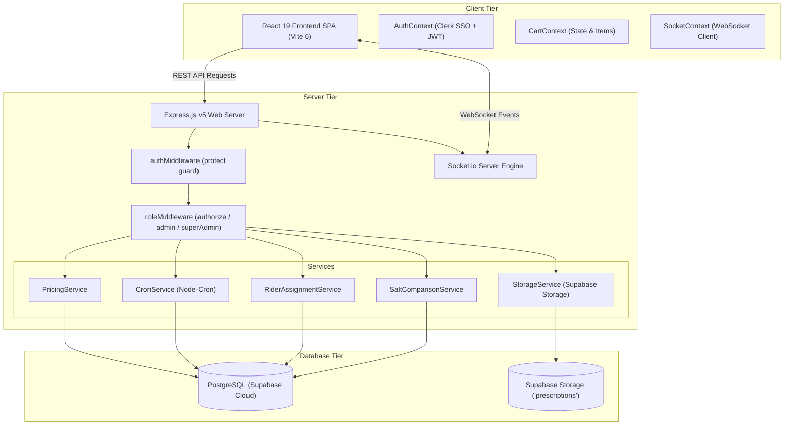
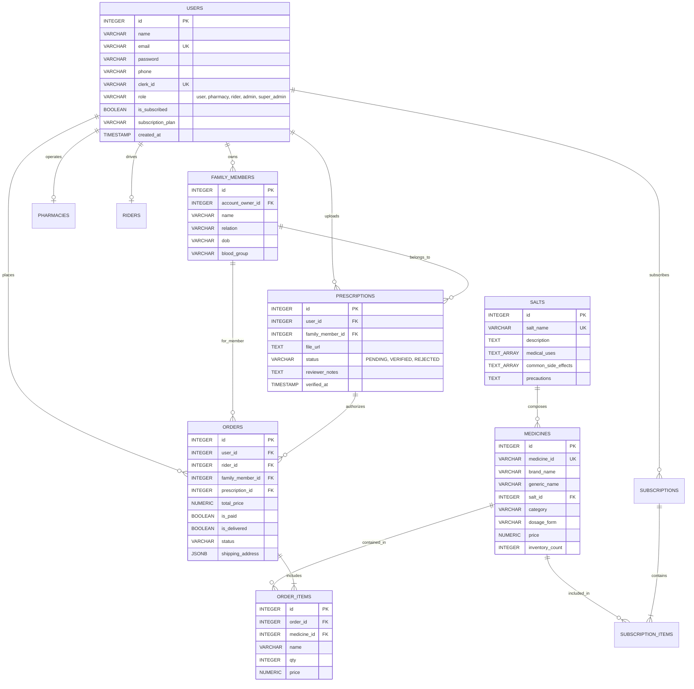

# Medifly — Emergency & Subscription Medicine Delivery Platform

[](https://nodejs.org/)
[](https://expressjs.com/)
[](https://react.dev/)
[](https://vitejs.dev/)
[](https://clerk.com/)
[](https://supabase.com/)
[](https://socket.io/)
[](LICENSE)

> **Medifly** is an enterprise-grade, real-time emergency healthcare delivery & prescription auto-refill platform built on Node.js **Express v5**, **React 19**, **Vite 6**, **Clerk Authentication & Multi-Tenancy**, and **PostgreSQL (Supabase Cloud)**. Medifly hosts over **254,000+ authentic medicines** and **11,800+ bioequivalent chemical salts**, featuring **30-Minute Ultra-Express Delivery**, GIN trigram indexed SQL search (`pg_trgm`), a bioequivalent salt comparison engine, cold-chain handling, automated subscription refills, a family prescription vault with signed file URLs, and role-based access portals for Patients, Pharmacists, Delivery Riders, and System Administrators.

---

## 📌 Current Project Stage & Tech Stack Overview

### 🚀 Current Project Stage: **Phase 5 — Full Codebase Audit & Production Architecture**

| Milestone / Feature | Stage / Status | Description |
| :--- | :--- | :--- |
| **Database Architecture** | **Completed** | PostgreSQL on Supabase Cloud with 254,000+ indexed medicines (`pg_trgm` GIN trigram indexing) |
| **Authentication & RBAC** | **Completed** | **Clerk SSO & Multi-Tenancy** (`@clerk/react` v6) + Custom express auth middleware (`authMiddleware.js`) with automatic user synchronization |
| **Full Codebase Audit & Data Scoping**| **Completed** | 100% elimination of mock data. Scoped SQL queries (`WHERE user_id = $1`, `WHERE account_owner_id = $1`) enforcing 100% account isolation |
| **Prescription Storage & Vault** | **Completed** | Private Supabase Storage bucket (`prescriptions`), 10-minute temporary signed URLs (`GET /api/vault/prescriptions/:id/file`), family member profiles, and server-side ownership security |
| **Auto-Refill Redesign** | **Completed** | Refill cycle tracker, discrete stat chips, medicine selection cards, and real backend API integration (`GET /api/subscriptions`) |
| **Role Hierarchy & Isolation**| **Completed** | Dual-tier `admin` & `super_admin` system with SQL-level visibility isolation (`WHERE role != 'super_admin'`) |
| **Post-Signup Onboarding** | **Completed** | Dedicated `/onboarding` screen collecting mandatory 10-digit phone number & delivery address upon Clerk signup |
| **Prescription Vault & Family Profiles**| **Completed** | Family member profiles (`Self`, `Spouse`, `Child`, `Parent`), member-scoped order history, and server-side ownership validation |
| **Fleet Rider Portal** | **Completed** | Real orders database integration (`GET /api/riders/deliveries`) with dynamic rider profile and live GPS location updating |
| **Search Relevance Engine**| **Completed** | Ranked SQL search prioritizing brand name prefix matches (e.g. `Telma`, `Telmikind`) ahead of generic salt composition matches |
| **Dosage Form Visuals** | **Completed** | Physical appearance image resolver (`getMedicineImage.js`) mapping `dosage_form` (tablet/capsule/injection/syrup/inhaler/topical) to assets |
| **Delivery SLA Engine** | **Completed** | **30-Minute Ultra-Express Delivery SLA**, Dynamic Multi-Tier Pricing Engine (`PricingService`), Cold-Chain Insulated Logistics |
| **Real-Time Dispatch** | **Completed** | WebSockets (`Socket.io`) for live rider GPS location streaming & instant order status notifications |
| **Salt Matching Engine** | **Completed** | Bioequivalent chemical salt matching & cost savings sorting (up to 70% cheaper generic alternatives) |
| **Deployment & Uptime** | **Completed** | Hosted backend on Render with UptimeRobot pinging `GET /health` to eliminate 15-minute inactivity spin-down |

---

### 🛠️ Comprehensive Tech Stack Summary

| Technology Layer | Stack / Library | Role & Responsibilities |
| :--- | :--- | :--- |
| **Frontend Framework** | **React 19, Vite 6, React Router v7** | Single Page Application UI with modular components, smooth page routing, and instant hot-reloading |
| **UI Styling & Icons** | **Vanilla CSS Modules, Lucide React** | Scoped component styling, vibrant dark/light themes, compact responsive layouts, and icon set |
| **Authentication & SSO** | **Clerk SSO (`@clerk/react` v6)** | Primary single sign-on authentication provider with Clerk `<SignIn />` / `<SignUp />` widgets & multi-tenancy role switching |
| **Backend Server** | **Node.js, Express v5.2.1** | REST API web server hosting pricing engines, dispatch logic, and database query handlers |
| **Database Engine** | **PostgreSQL (Supabase Cloud)** | Relational database hosting 254k+ medicines, 11k+ salts, orders, prescriptions, and users with GIN trigram indexing |
| **File Storage** | **Supabase Storage** | Private bucket (`prescriptions`) for storing user prescription documents with 10-minute temporary signed URLs |
| **Real-Time WebSockets**| **Socket.io v4.8.3** | Bidirectional real-time WebSocket communication for live rider location streaming and instant order updates |
| **Background Automation**| **Node-cron** | Automated daily subscription scanner and zero-touch recurring order generation |

---

## Quick Links & Demo Credentials

- **GitHub Repository**: [https://github.com/em-srs/Medifly](https://github.com/em-srs/Medifly)
- **API Documentation**: [Exhaustive API Reference](#exhaustive-api-reference--calling-guide)

### Demo Portal Credentials & 1-Click Role Presets

| Portal / Role | Email Address | Password | Permissions & Features |
| :--- | :--- | :--- | :--- |
| **Regular Patient (`user`)** | `user@medifly.com` | `user123` | Search 254k+ meds, Cart, 30-Min Express Checkout, Family Vault, Orders, Auto-Refill |
| **Pharmacist (`pharmacy`)** | `pharma@medifly.com` | `pharma123` | Pharmacy Workstation, Prescription Document Review (`VERIFIED` / `REJECTED`), Inventory Updates |
| **Fleet Rider (`rider`)** | `rider@medifly.com` | `rider123` | Fleet Dispatch Terminal, Live GPS Location Updates (`lat`/`lng`), Active Order Deliveries |
| **System Admin (`admin`)** | `admin@medifly.com` | `admin123` | Admin Command Center, PostgreSQL Revenue Analytics, System Overrides, Low-Stock Alerts |
| **Super Admin (`super_admin`)** | `superadmin@medifly.com`| `superadmin123`| Full System Governance, Executive Admin Dashboard, Super Admin User Management |

---

## ⚡ Primary Brand Motto & Delivery SLA Architecture

### ⚡ **"Medicines Delivered in 30 Minutes"**
Medifly's primary mission across every page, header, and order dispatch service is **"Medicines Delivered in 30 Minutes"**.

### 📦 Structured Delivery Speed SLA Matrix

| Delivery Tier | Target SLA | Applicable Categories & Features |
| :--- | :--- | :--- |
| ⚡ **30-Min Ultra Express** | **30 Minutes** | Emergency acute care, pain relievers, fever meds, asthma inhalers, allergy relief, first-aid kits |
| 🚀 **1-Hour Priority Standard** | **60 Minutes** | General daily doctor prescriptions & OTC medicines from local licensed partner pharmacies |
| ❄️ **Same-Day Cold Chain** | **2–8°C Insulated** | Temperature-monitored transportation for insulin, vaccines, growth hormones & biological injections |
| 🔄 **Scheduled Auto-Refill** | **Recurring 30 Days** | Automated monthly refills for chronic conditions (BP, diabetes, heart care) delivered 3 days before stock ends |

---

## Key Features & UI Highlights

### 1. 254,000+ Medicine Dataset & PostgreSQL Engine
- **Enterprise Dataset**: Pre-seeded with **254,023 authentic medicines** and **11,850 chemical salt compositions**.
- **PostgreSQL GIN Trigram Indexing (`pg_trgm`)**: Sub-millisecond indexed SQL search across brand names, generic compositions, and manufacturers.

### 2. Multi-Role Portal Engine (RBAC)
- **Patient Workspace**: Interactive 30-minute express medicine browser, hero live search widget, salt comparison tool, family prescription vault, order tracker, and auto-refill subscriptions.
- **Pharmacist Workstation**: Verification terminal to review uploaded prescription documents (`PENDING` -> `VERIFIED` / `REJECTED`) and manage pharmacy inventory stock.
- **Fleet Rider Terminal**: Real-time dispatch interface to update live GPS coordinates (`lat`/`lng`) and switch availability status (`OFFLINE` -> `ONLINE` -> `ON_DELIVERY`).
- **Admin Command Center**: Real-time PostgreSQL database analytics summarizing total revenue, total orders, active user counts, and low-stock alerts (`inventory_count < 10`).

### 3. Salt Comparison & Generic Alternative Engine
- **Bioequivalent Matching**: Queries the `salts` and `medicines` relational SQL tables to locate medicines sharing identical active chemical compositions.
- **Cost Savings Sorting**: Automatically presents generic alternatives sorted by price ascending, enabling users to save up to 70% on medication costs.

### 4. Dynamic Multi-Tier Pricing Engine (`PricingService`)
- Calculates items subtotal, 5% Goods and Services Tax (GST), platform fee, delivery fee, cold-chain handling fee, emergency surcharge, and late-night surcharge.
- **Subscription Discounts**:
  - **Platform Fee**: Reduced from ₹6.00 to ₹2.00 for subscribers.
  - **Cold-Chain Fee**: Discounted from ₹25.00 to ₹15.00 for cold-storage medications.
  - **Emergency Surcharge**: Reduced by 50% from ₹50.00 to ₹25.00.
  - **Late-Night Delivery Fee**: Fully waived (₹0 vs ₹20.00 for non-subscribers between 10 PM and 6 AM).

### 5. Automated Subscription & Refill Engine (`CronService`)
- **Cron Scheduler**: Inspects active subscriptions daily where `next_delivery_date <= Today`.
- **Zero-Touch Order Generation**: Automatically instantiates verified orders, applies subscriber perks, decrements inventory stock, and calculates next delivery date based on frequency (`WEEKLY`, `BIWEEKLY`, `MONTHLY`).

### 6. Real-Time WebSockets (`Socket.io`)
- `priceChanged`: Broadcasts instant price updates across connected clients when a medicine price is updated.
- `inventoryChanged`: Pushes real-time stock availability and inventory counts when orders are placed.
- `orderStatusChanged`: Delivers live status updates (`pending` -> `verified` -> `assigned` -> `picked_up` -> `delivered`) to the user's private socket room.
- `riderLocationUpdated`: Streams live rider GPS coordinates directly to the user awaiting delivery.
- `prescriptionVerified`: Notifies the patient as soon as a pharmacist approves or rejects their prescription.

### 7. Prescription Vault & Family Profiles
- **Family Profiles**: Manage medical records for `Self`, `Spouse`, `Child`, `Parent`, and `Sibling`.
- **Signed URL Access**: Upload prescription files to private Supabase Storage buckets with 10-minute temporary signed URLs for secure viewing.
- **Server-Side Security**: Enforces ownership verification (`account_owner_id === req.user.id`) to prevent unauthorized document access.

---

## Architecture & System Flow

### System Layer Architecture



---

### Entity Relationship Diagram (ERD)



---

## Exhaustive API Reference & Calling Guide

### Authentication & Users (`/api/auth` & `/api/users`)
- `POST /api/auth/register` — Register new local patient account
- `POST /api/auth/login` — Authenticate local patient account
- `GET /api/auth/profile` — Fetch authenticated profile
- `POST /api/users/sync` — Sync user profile from Clerk SSO
- `GET /api/users/me` — Get current PostgreSQL user record
- `PUT /api/users/me` — Update user profile (Name, Phone, Address)
- `GET /api/users/stats` — Retrieve user dashboard counters

### Medicines & Salt Matching (`/api/medicines`)
- `GET /api/medicines` — Search medicines (supports `keyword`, `pageNumber`, GIN trigram indexing)
- `GET /api/medicines/:id` — Fetch single medicine details
- `GET /api/medicines/alternatives/:saltName` — Query bioequivalent generic alternatives
- `GET /api/medicines/salt-comparison/:medicineId` — Bioequivalent salt comparison matrix
- `PUT /api/medicines/:id/price` — Update medicine price (Admin/Pharmacy + Socket emission)

### Orders & Checkout (`/api/orders`)
- `POST /api/orders` — Create new order with pricing engine calculations
- `GET /api/orders/myorders` — Retrieve orders placed by current user
- `GET /api/orders/:id` — Get detailed order summary & tracking data
- `PUT /api/orders/:id/pay` — Mark order as paid

### Prescriptions & Vault (`/api/prescriptions` & `/api/vault`)
- `POST /api/prescriptions` — Upload prescription document URL
- `GET /api/prescriptions/my` — List user's uploaded prescriptions
- `PUT /api/prescriptions/:id/verify` — Pharmacist verification (`VERIFIED` / `REJECTED`)
- `GET /api/vault/members` — List family members for account owner
- `POST /api/vault/members` — Add new family member
- `GET /api/vault/members/:id/prescriptions` — Fetch family member prescriptions
- `POST /api/vault/members/:id/prescriptions` — Upload prescription document to Supabase
- `GET /api/vault/prescriptions/:id/file` — Stream signed 10-minute file URL

### Subscriptions & Auto-Refill (`/api/subscriptions`)
- `POST /api/subscriptions` — Create new recurring refill subscription
- `GET /api/subscriptions` — Retrieve user's active subscriptions
- `PATCH /api/subscriptions/:id/status` — Update subscription status (`ACTIVE`, `PAUSED`, `CANCELLED`)

### Portals & Administration (`/api/pharmacy`, `/api/riders`, `/api/admin`, `/api/support`)
- `POST /api/pharmacy` — Apply for pharmacy partner status
- `GET /api/pharmacy/dashboard` — Access pharmacy workstation inventory & orders
- `POST /api/riders` — Register as fleet delivery rider
- `PUT /api/riders/location` — Update rider live GPS location (`lat`/`lng`)
- `GET /api/riders/deliveries` — Retrieve assigned delivery orders for rider
- `GET /api/admin/dashboard` — Platform stats & revenue analytics
- `GET /api/admin/users` — List system users with SQL-level role isolation
- `GET /api/admin/vault/attribution` — Vault family attribution analytics
- `POST /api/support` — Submit customer support request

---

## Directory Structure & Sitemap

```
medifly-mern/
├── backend/
│   ├── config/             # Database connection & PostgreSQL schema init (db.js)
│   ├── controllers/        # REST API route controllers
│   ├── middleware/         # authMiddleware (Clerk/JWT) & roleMiddleware (RBAC)
│   ├── models/             # Schema references
│   ├── routes/             # Express API router definitions
│   ├── services/           # PricingService, CronService, RiderAssignment, StorageService
│   ├── scripts/            # Database test suites & utility scripts
│   ├── socket.js           # Socket.io real-time event dispatcher
│   └── server.js           # Express app initialization & server entry point
├── frontend/
│   ├── public/             # Static assets & brand icons
│   └── src/
│       ├── components/     # Header, Footer, CartSidebar, MedicineCard, ProtectedRoute
│       ├── context/        # AuthContext, CartContext, SocketContext
│       ├── pages/          # HomePage, MedicinesPage, PrescriptionsPage, ProfilePage,
│       │                   # AdminPage, PharmacyPage, RiderPage, SaltComparePage,
│       │                   # SubscriptionPage, OnboardingPage, AboutPage, CheckoutPage
│       ├── utils/          # getMedicineImage visual resolver & helpers
│       ├── App.jsx         # React Router v7 layout & route mappings
│       └── main.jsx        # ClerkProvider & application root mounting
├── notes.md                # Comprehensive technical interview preparation guide
└── README.md               # Production documentation & project reference
```

---

## Local Development & Setup Guide

### Prerequisites
- **Node.js**: v18.0.0 or higher
- **npm**: v9.0.0 or higher
- **PostgreSQL Database**: Local PostgreSQL instance or Supabase Cloud credentials
- **Clerk Account**: Active Clerk application credentials

### 1. Repository Setup & Dependencies Installation
Clone the repository and install dependencies for both `backend` and `frontend`:
```bash
git clone https://github.com/em-srs/Medifly.git
cd Medifly

# Install root, backend, and frontend dependencies
npm run install:all
```

### 2. Environment Variables Configuration

Create a `.env` file in the `backend/` directory:
```env
PORT=5000
NODE_ENV=development
DATABASE_URL=postgresql://postgres:[PASSWORD]@[HOST]:5432/postgres
PGSSL=true
JWT_SECRET=medifly_secret_key_2026
SUPABASE_URL=https://[YOUR_PROJECT].supabase.co
SUPABASE_KEY=[YOUR_SUPABASE_SERVICE_KEY]
```

Create a `.env` file in the `frontend/` directory:
```env
VITE_CLERK_PUBLISHABLE_KEY=pk_test_[YOUR_CLERK_KEY]
VITE_API_URL=http://localhost:5000
```

### 3. Launch Development Servers
Start both backend API server (Port `5000`) and Vite frontend dev server (Port `5173`) concurrently:
```bash
npm run dev
```

Or start servers individually:
```bash
# Start backend server only
npm run dev:backend

# Start frontend Vite server only
npm run dev:frontend
```

---

## Security, Data Isolation & Best Practices

1. **Strict Data Scoping**: All user queries execute with parameter bindings (`WHERE user_id = $1` or `WHERE account_owner_id = $1`), ensuring 100% account data isolation.
2. **Server-Side Role Guarding**: Roles are assigned server-side in PostgreSQL. Frontend route checking provides smooth UX while Express middleware blocks unauthorized API calls.
3. **Private File Vaulting**: User prescriptions are kept in a private storage bucket. File access tokens expire after 10 minutes (`createSignedUrl`).
4. **Environment Safety**: Secrets, API keys, database credentials, and upload files are excluded from Git version control via `.gitignore`.
