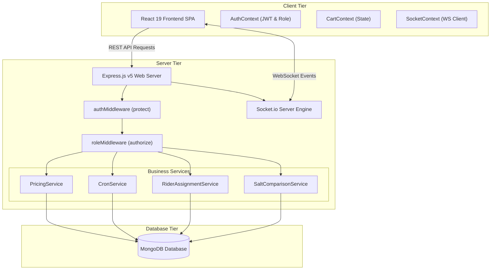
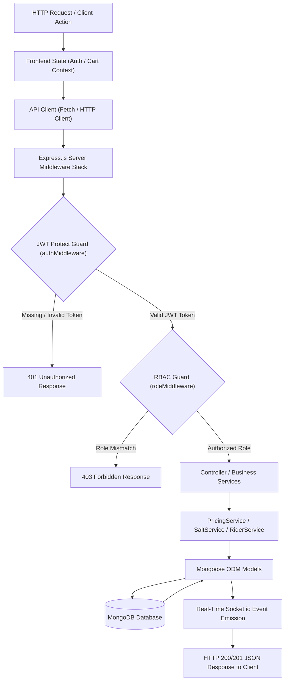
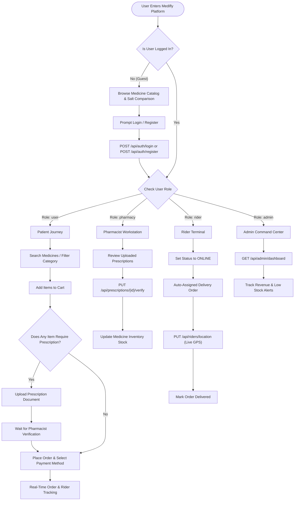
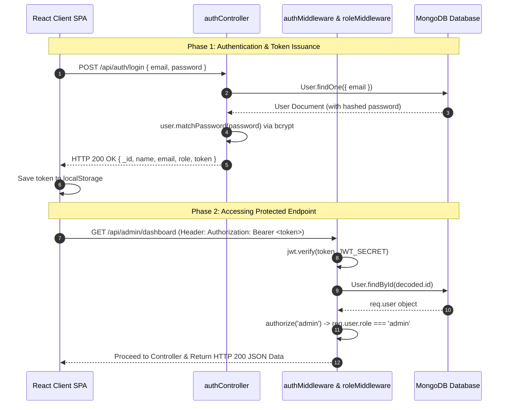
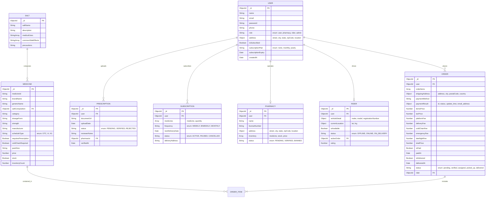

# Medifly — Emergency & Subscription Medicine Delivery Platform

[](https://nodejs.org/)
[](https://expressjs.com/)
[](https://react.dev/)
[](https://vitejs.dev/)
[](https://mongoosejs.com/)
[](https://socket.io/)
[](https://jwt.io/)
[](LICENSE)

> **Medifly** is a enterprise-grade, real-time emergency healthcare delivery & prescription auto-refill platform. Built on the MERN stack with Express v5 and React 19, Medifly features live WebSocket tracking, salt comparison engine for generic bioequivalent alternatives, multi-tier pricing with cold-chain fees, automated cron refills, and role-based portals for Patients, Pharmacists, Fleet Riders, and System Administrators.

---

## Quick Links & Demo Credentials

- **Live Platform Demo**: [https://medifly-demo.vercel.app](https://medifly-demo.vercel.app)
- **Video Walkthrough**: [https://youtube.com/watch?v=medifly-demo](https://youtube.com/watch?v=medifly-demo)
- **API Documentation**: [Exhaustive API Reference](#exhaustive-api-reference--calling-guide)

### Demo Portal Credentials

| Portal / Role | Email Address | Password | Permissions & Features |
| :--- | :--- | :--- | :--- |
| **Regular Patient (`user`)** | `user@medifly.com` | `user123` | Medicine search, Cart, Rx Upload, Checkout, Orders, Subscriptions |
| **Pharmacist (`pharmacy`)** | `pharma@medifly.com` | `pharma123` | Pharmacy Dashboard, Rx Verification workstation, Inventory updates |
| **Fleet Rider (`rider`)** | `rider@medifly.com` | `rider123` | Rider Dashboard, Live GPS Location updates, Active order delivery |
| **System Admin (`admin`)** | `admin@medifly.com` | `admin123` | Admin Analytics Dashboard, Revenue reports, Low-stock alerts, System overrides |

---

## Key Features & UI Highlights

### 1. Multi-Role Portal Engine
- **Patient Workspace**: Interactive medicine browser with real-time stock indicator, instant add-to-cart, prescription file uploader, order history, and recurring refill management.
- **Pharmacist Workstation**: Verification dashboard to review uploaded prescription documents (`PENDING` -> `VERIFIED` / `REJECTED`) and manage pharmacy inventory stock.
- **Fleet Rider Terminal**: Real-time dispatch interface to update live GPS coordinates (`lat`/`lng`) and switch availability status (`OFFLINE` -> `ONLINE` -> `ON_DELIVERY`).
- **Admin Command Center**: High-level platform analytics summarizing total revenue, total orders, active user counts, and automated low-stock alerts (`inventoryCount < 10`).

### 2. Salt Comparison & Generic Alternative Engine
- **Bioequivalent Matching**: Queries the `Salts` database collection to locate medicines sharing identical active pharmaceutical ingredients (APIs).
- **Cost Savings Sorting**: Automatically presents generic and brand alternatives sorted by price ascending, enabling users to save up to 70% on medication costs.

### 3. Dynamic Multi-Tier Pricing Engine (`PricingService`)
- **Automated Breakdown**: Calculates subtotal, 5% Goods and Services Tax (GST), platform fee, delivery fee, cold-chain handling fee, emergency delivery surcharge, and late-night surcharge.
- **Subscription Discounts**:
  - **Platform Fee**: Reduced from ₹6.00 to ₹2.00 for subscribers.
  - **Cold-Chain Handling Fee**: Discounted from ₹25.00 to ₹15.00 for cold-storage medications.
  - **Emergency Surcharge**: Reduced by 50% from ₹50.00 to ₹25.00.
  - **Late-Night Delivery Fee**: Fully waived (₹0 vs ₹20.00 for non-subscribers between 10 PM and 6 AM).

### 4. Automated Subscription & Refill Engine (`CronService`)
- **Node-Cron Scheduler**: Runs daily at midnight (`0 0 * * *`) to inspect active subscriptions where `nextDeliveryDate <= Today`.
- **Zero-Touch Order Generation**: Automatically instantiates verified orders, applies subscriber perks (e.g., VIP Free Delivery), decrements inventory stock, and calculates next delivery date based on frequency (`WEEKLY`, `BIWEEKLY`, `MONTHLY`).

### 5. Real-Time WebSockets (`Socket.io`)
- `priceChanged`: Broadcasts instant price updates across all connected clients when a medicine price is updated.
- `inventoryChanged`: Pushes real-time stock availability and inventory counts when orders are placed.
- `orderStatusChanged`: Delivers instant status updates (`pending` -> `verified` -> `assigned` -> `picked_up` -> `delivered`) to the user's private WebSocket room.
- `riderLocationUpdated`: Streams live rider GPS coordinates directly to the user awaiting delivery.
- `prescriptionVerified`: Notifies the patient as soon as a pharmacist approves or rejects their prescription.

### 6. Design System & User Interface
- **Modern UI Styling**: Developed with CSS Modules and dynamic HSL CSS variable color tokens for seamless dark/light contrast, glassmorphic cards, and smooth micro-animations.
- **Formatting Utilities**: Built-in currency formatting (`₹`), MRP discount percentage calculators, and schedule type tags (`OTC`, `Schedule H`, `Schedule H1`).

---

## Architecture & System Flow

### System Layer Architecture (Text Diagram)

```
+-----------------------------------------------------------------------------------+
|                                 CLIENT TIER                                       |
|  React 19 Single Page Application (Vite 6) + React Router v7 + Lucide React Icons |
|  Context Providers: AuthContext (JWT/Role) | CartContext | SocketContext (WS)     |
+-----------------------------------------------------------------------------------+
                                         |
                                HTTP / REST & WebSockets
                                         |
+-----------------------------------------------------------------------------------+
|                                 SERVER TIER                                       |
|  Node.js + Express v5 Web Application Server                                      |
|  Middlewares: Auth Middleware (JWT Protect) | Role Middleware (RBAC Authorization)|
|  Controllers: Auth, Medicine, Order, Prescription, Pharmacy, Rider, Subscription, Admin |
|  Services: PricingService | CronService | RiderAssignmentService | SaltComparison  |
|  Socket.io Engine: Real-Time Event Dispatcher & Room Management                   |
+-----------------------------------------------------------------------------------+
                                         |
                                Mongoose v9 ODM Driver
                                         |
+-----------------------------------------------------------------------------------+
|                                DATABASE TIER                                      |
|  MongoDB Document Store                                                           |
|  Collections: Users, Medicines, Salts, Orders, Prescriptions, Pharmacies, Riders, Subs|
+-----------------------------------------------------------------------------------+
```

### High-Level Architecture Diagram (Mermaid)



---

## System Data Flow Diagram



---

## User Flow & Journey Diagram



---

## JWT Authentication & Security Section

Medifly implements end-to-end stateless security utilizing JSON Web Tokens (JWT) and strong password hashing.

### 1. Password Hashing
User passwords are encrypted asynchronously before persistent storage in MongoDB using **Bcrypt.js** with 10 salt rounds:
```javascript
UserSchema.pre('save', async function(next) {
  if (!this.isModified('password')) return next();
  const salt = await bcrypt.genSalt(10);
  this.password = await bcrypt.hash(this.password, salt);
});
```

### 2. Token Payload Claims
Upon successful authentication, the server signs a JWT containing the user's unique MongoDB identifier:
```json
{
  "id": "65f1a2b3c4d5e6f7a8b9c0d1",
  "iat": 1770438000,
  "exp": 1773030000
}
```

### 3. Header Transmission
Clients pass the JWT token in the HTTP `Authorization` request header:
```http
Authorization: Bearer <JWT_TOKEN_STRING>
```

### 4. Middleware Authorization Guards
- `protect`: Extracts token from `Authorization` header, verifies signature via `jwt.verify()`, fetches target user from MongoDB excluding password (`.select('-password')`), and attaches user object to `req.user`.
- `authorize(...roles)`: Verifies if `req.user.role` matches one of the required authorization roles (`user`, `pharmacy`, `rider`, `admin`). Returns HTTP `403 Forbidden` on role mismatch.

### JWT Authentication Sequence Diagram



---

## Project Directory Structure

```ascii
medifly-mern/
├── README.md                          # Main Repository Documentation
├── notes.md                           # Technical Interview Prep & Revision Notebook
├── package.json                       # Root Workspace Package Configuration
├── package-lock.json                  # Root Package Lock
├── .gitignore                         # Repository Git Ignore Rules
│
├── backend/                           # Node.js + Express v5 Application Server
│   ├── .env                           # Environment Variables (PORT, MONGODB_URI, JWT_SECRET)
│   ├── package.json                   # Backend Dependencies (Express 5, Mongoose 9, Socket.io)
│   ├── server.js                      # Express App Initialization, Route Mounts & Error Handler
│   ├── socket.js                      # Socket.io Singleton Engine & Room Handler
│   ├── config/
│   │   ├── db.js                      # MongoDB Database Connection Setup
│   │   └── auth.js                    # JWT Configuration Parameters
│   ├── controllers/                   # HTTP Request Handlers & Business Logic
│   │   ├── adminController.js         # Administrative Analytics & Low-Stock Dashboard
│   │   ├── authController.js          # User Registration, Login & Profile Handlers
│   │   ├── medicineController.js      # Medicine Catalog, Salt Comparison & Price Updates
│   │   ├── orderController.js         # Order Creation, Rx Checks, Pricing & Stock Decrement
│   │   ├── pharmacyController.js      # Pharmacy Registration & Workstation Dashboard
│   │   ├── prescriptionController.js  # Prescription Upload & Pharmacist Verification
│   │   ├── riderController.js         # Rider Registration & Real-Time GPS Tracking
│   │   └── subscriptionController.js  # Refill Subscription Management
│   ├── middleware/                    # Security & Protection Middleware
│   │   ├── authMiddleware.js          # JWT Verification & req.user Attachment Guard
│   │   └── roleMiddleware.js          # Role-Based Access Control (RBAC) Guard
│   ├── models/                        # Mongoose Data Schemas & Models
│   │   ├── User.js                    # User Account & Premium Subscription Schema
│   │   ├── Medicine.js                # Medicine Inventory & Specifications Schema
│   │   ├── Salt.js                    # Bioequivalent Chemical Salt Schema
│   │   ├── Order.js                   # Customer Order & Snapshot Price Schema
│   │   ├── Prescription.js            # Uploaded Rx Document & Reviewer Notes Schema
│   │   ├── Pharmacy.js                # Pharmacy Store & Inventory Schema
│   │   ├── Rider.js                   # Fleet Rider & Location Tracking Schema
│   │   └── Subscription.js            # Auto-Refill Subscription Schedule Schema
│   ├── routes/                        # Express API Route Mapping Definitions
│   │   ├── adminRoutes.js             # /api/admin Endpoints
│   │   ├── authRoutes.js              # /api/auth Endpoints
│   │   ├── medicineRoutes.js          # /api/medicines Endpoints
│   │   ├── orderRoutes.js             # /api/orders Endpoints
│   │   ├── pharmacyRoutes.js          # /api/pharmacy Endpoints
│   │   ├── prescriptionRoutes.js      # /api/prescriptions Endpoints
│   │   ├── riderRoutes.js             # /api/riders Endpoints
│   │   └── subscriptionRoutes.js      # /api/subscriptions Endpoints
│   ├── services/                      # Decoupled Domain Business Logic
│   │   ├── cronService.js             # Midnight Subscription Auto-Refill Scheduler
│   │   ├── pricingService.js          # Multi-Tier Tax, Fee & Surcharge Calculator
│   │   ├── riderAssignmentService.js  # Automated Rider Dispatch Logic
│   │   └── saltComparisonService.js   # Bioequivalent Alternative Matcher
│   ├── data/
│   │   └── medicines.csv              # Initial Medicine Dataset File
│   └── scripts/
│       └── seedMedicines.js           # Database Ingestion & Seeding Script
│
└── frontend/                          # React 19 + Vite Frontend SPA Application
    ├── package.json                   # Frontend Dependencies (React 19, Vite 6, Lucide)
    ├── vite.config.js                 # Vite Bundler Setup & Path Aliasing (@ -> /src)
    ├── index.html                     # HTML Template Entrypoint
    └── src/
        ├── main.jsx                   # React DOM Entrypoint
        ├── App.jsx                    # React Router v7 Routes & App Shell Layout
        ├── index.css                  # Global CSS Design Tokens & Utilities
        ├── components/                # Modular Reusable UI Components
        │   ├── Header.jsx             # Navigation Bar with Role Links & Cart Trigger
        │   ├── Footer.jsx             # App Footer with Links & Platform Info
        │   ├── CartSidebar.jsx        # Slide-over Shopping Cart & Fee Summary
        │   └── MedicineCard.jsx       # Interactive Medicine Display Card
        ├── context/                   # Global React Context State Providers
        │   ├── AuthContext.jsx        # Auth Session & Role Management Context
        │   ├── CartContext.jsx        # Shopping Cart State & Items Management
        │   └── SocketContext.jsx      # WebSocket Real-Time Event Listener Context
        ├── data/                      # Client Mock Data & Helpers
        └── pages/                     # Application Page Components (29 Files)
            ├── HomePage.jsx           # Landing Page with Hero & Features
            ├── MedicinesPage.jsx      # Catalog Search, Filter & Salt Comparison
            ├── PrescriptionsPage.jsx  # Rx Upload & Verification Status Page
            ├── SubscriptionPage.jsx   # Recurring Subscription Refill Manager
            ├── CheckoutPage.jsx       # Order Checkout & Multi-Tier Fee Review
            ├── OrdersPage.jsx         # User Order History & Real-Time Tracking
            ├── SaltComparePage.jsx    # Generic Bioequivalent Salt Alternative Tool
            ├── DashboardPage.jsx      # User Overview Dashboard
            ├── AdminPage.jsx          # Admin System Analytics & Stock Alerts
            ├── PharmacyPage.jsx       # Pharmacist Verification Terminal
            ├── RiderPage.jsx          # Rider Dispatch & GPS Tracker Terminal
            ├── ProfilePage.jsx        # User Account Profile Manager
            ├── SettingsPage.jsx       # User Settings Panel
            ├── AboutPage.jsx          # About Medifly Page
            └── ContactPage.jsx        # Support & Contact Page
```

---

## Entity Relationship Diagram (ERD)



---

## Exhaustive API Reference & Calling Guide

### API Endpoints Summary Table

| Category | Method | URL Path | Auth Required | Allowed Roles | Description |
| :--- | :--- | :--- | :--- | :--- | :--- |
| **Auth** | `POST` | `/api/auth/register` | Public | All | Register a new user account |
| **Auth** | `POST` | `/api/auth/login` | Public | All | Authenticate user & return JWT token |
| **Auth** | `GET` | `/api/auth/profile` | Private | All Logged In | Get currently authenticated user profile |
| **Medicines** | `GET` | `/api/medicines` | Public | All | List medicines with keyword search & pagination |
| **Medicines** | `GET` | `/api/medicines/:id` | Public | All | Fetch single medicine by MongoDB ID |
| **Medicines** | `GET` | `/api/medicines/alternatives/:saltName` | Public | All | Find generic alternatives by salt name |
| **Medicines** | `GET` | `/api/medicines/salt-comparison/:medicineId` | Public | All | Compare bioequivalent salts for a medicine |
| **Medicines** | `PUT` | `/api/medicines/:id/price` | Private | Admin / Pharmacy | Update medicine price & trigger WS broadcast |
| **Orders** | `POST` | `/api/orders` | Private | `user` | Create order with stock/Rx check & pricing |
| **Orders** | `GET` | `/api/orders/myorders` | Private | `user` | Fetch logged-in user's order history |
| **Orders** | `GET` | `/api/orders/:id` | Private | `user`, `admin` | Fetch order details by ID |
| **Orders** | `PUT` | `/api/orders/:id/pay` | Private | `user` | Update order payment status to paid |
| **Prescriptions**| `POST` | `/api/prescriptions` | Private | `user` | Upload a new prescription document |
| **Prescriptions**| `GET` | `/api/prescriptions/my` | Private | `user` | Fetch logged-in user's prescriptions |
| **Prescriptions**| `PUT` | `/api/prescriptions/:id/verify` | Private | `pharmacy`, `admin` | Verify/reject uploaded prescription |
| **Subscriptions**| `POST` | `/api/subscriptions` | Private | `user` | Create auto-refill delivery subscription |
| **Subscriptions**| `GET` | `/api/subscriptions` | Private | `user` | Fetch user's active subscriptions |
| **Pharmacy** | `POST` | `/api/pharmacy` | Private | `user` | Register a new pharmacy store |
| **Pharmacy** | `GET` | `/api/pharmacy/dashboard` | Private | `pharmacy`, `admin` | Get pharmacy store dashboard details |
| **Riders** | `POST` | `/api/riders` | Private | `user` | Register a new fleet rider |
| **Riders** | `PUT` | `/api/riders/location` | Private | `rider` | Update live rider GPS location |
| **Admin** | `GET` | `/api/admin/dashboard` | Private | `admin` | Get platform analytics & stock alerts |

---

### Detailed Endpoint Specifications

---

#### 1. Auth Service

##### `POST /api/auth/register`
- **Description**: Registers a new user on the platform.
- **Auth Required**: Public (No Token)
- **Headers**:
  - `Content-Type: application/json`
- **Request Body**:
```json
{
  "name": "John Doe",
  "email": "john@example.com",
  "password": "securePassword123",
  "phone": "+919876543210"
}
```
- **Response `201 Created`**:
```json
{
  "_id": "65f1a2b3c4d5e6f7a8b9c0d1",
  "name": "John Doe",
  "email": "john@example.com",
  "role": "user",
  "token": "eyJhbGciOiJIUzI1NiIsInR5cCI6IkpXVCJ9..."
}
```
- **Error Codes**: `400 Bad Request` (User already exists), `500 Internal Server Error`.

---

##### `POST /api/auth/login`
- **Description**: Authenticates user credentials and returns JWT token.
- **Auth Required**: Public (No Token)
- **Headers**:
  - `Content-Type: application/json`
- **Request Body**:
```json
{
  "email": "john@example.com",
  "password": "securePassword123"
}
```
- **Response `200 OK`**:
```json
{
  "_id": "65f1a2b3c4d5e6f7a8b9c0d1",
  "name": "John Doe",
  "email": "john@example.com",
  "role": "user",
  "token": "eyJhbGciOiJIUzI1NiIsInR5cCI6IkpXVCJ9..."
}
```
- **Error Codes**: `401 Unauthorized` (Invalid email or password), `500 Internal Server Error`.

---

##### `GET /api/auth/profile`
- **Description**: Retrieves current authenticated user profile.
- **Auth Required**: Private (`Authorization: Bearer <token>`)
- **Headers**:
  - `Authorization: Bearer <token>`
- **Response `200 OK`**:
```json
{
  "_id": "65f1a2b3c4d5e6f7a8b9c0d1",
  "name": "John Doe",
  "email": "john@example.com",
  "phone": "+919876543210",
  "role": "user",
  "isSubscribed": false,
  "subscriptionPlan": "none",
  "createdAt": "2026-08-01T10:00:00.000Z"
}
```
- **Error Codes**: `401 Unauthorized`, `404 Not Found`.

---

#### 2. Medicines Service

##### `GET /api/medicines`
- **Description**: Retrieves paginated list of medicines with search filter.
- **Auth Required**: Public
- **Query Parameters**:
  | Parameter | Type | Required | Default | Description |
  | :--- | :--- | :--- | :--- | :--- |
  | `keyword` | String | No | None | Search term for brand or generic name |
  | `pageNumber` | Number | No | 1 | Page number for pagination |
- **Response `200 OK`**:
```json
{
  "medicines": [
    {
      "_id": "65f1a2b3c4d5e6f7a8b9c0d2",
      "medicineId": "MED-001",
      "brandName": "Paracetamol 650",
      "genericName": "Paracetamol",
      "saltComposition": "65f1a2b3c4d5e6f7a8b9c0d0",
      "category": "Analgesics",
      "dosageForm": "Tablet",
      "strength": "650mg",
      "manufacturer": "Cipla",
      "scheduleType": "OTC",
      "requiresPrescription": false,
      "coldChainRequired": false,
      "packSize": "15 Tablets",
      "price": 32.50,
      "stock": true,
      "inventoryCount": 50
    }
  ],
  "page": 1,
  "pages": 5
}
```

---

##### `GET /api/medicines/:id`
- **Description**: Fetches single medicine details by ID.
- **Auth Required**: Public
- **Response `200 OK`**: Single `Medicine` object.
- **Error Codes**: `404 Not Found`.

---

##### `GET /api/medicines/salt-comparison/:medicineId`
- **Description**: Returns bioequivalent alternative medicines with identical salt composition sorted by lowest price.
- **Auth Required**: Public
- **Response `200 OK`**:
```json
{
  "original_medicine": {
    "_id": "65f1a2b3c4d5e6f7a8b9c0d2",
    "brandName": "Calpol 650",
    "price": 35.00
  },
  "alternative_medicines": [
    {
      "_id": "65f1a2b3c4d5e6f7a8b9c0d3",
      "brandName": "Dolo 650",
      "price": 28.00
    }
  ]
}
```

---

##### `PUT /api/medicines/:id/price`
- **Description**: Updates medicine price and broadcasts WebSocket update.
- **Auth Required**: Private (`Authorization: Bearer <token>`)
- **Role Required**: `admin` or `pharmacy`
- **Request Body**: `{ "price": 29.50 }`
- **Response `200 OK`**: Updated `Medicine` object.

---

#### 3. Orders Service

##### `POST /api/orders`
- **Description**: Validates inventory stock, verifies mandatory prescriptions, calculates multi-tier price breakdown, decrements stock atomically, assigns rider, and creates order.
- **Auth Required**: Private (`Authorization: Bearer <token>`)
- **Request Body**:
```json
{
  "orderItems": [
    {
      "medicine": "65f1a2b3c4d5e6f7a8b9c0d2",
      "qty": 2
    }
  ],
  "shippingAddress": {
    "address": "123 Health St",
    "city": "Mumbai",
    "postalCode": "400001",
    "country": "India"
  },
  "paymentMethod": "Razorpay",
  "prescriptionId": "65f1a2b3c4d5e6f7a8b9c0d9",
  "isEmergency": true
}
```
- **Response `201 Created`**:
```json
{
  "_id": "65f1a2b3c4d5e6f7a8b9c0e0",
  "user": "65f1a2b3c4d5e6f7a8b9c0d1",
  "itemsPrice": 65.00,
  "taxPrice": 3.25,
  "platformFee": 6.00,
  "deliveryFee": 30.00,
  "coldChainFee": 0.00,
  "emergencyFee": 50.00,
  "lateNightFee": 0.00,
  "totalPrice": 154.25,
  "status": "assigned",
  "isPaid": false
}
```
- **Error Codes**: `400 Bad Request` (Insufficient stock / Prescription required / Unverified Rx), `404 Not Found`.

---

##### `GET /api/orders/myorders`
- **Description**: Retrieves logged-in user's orders.
- **Auth Required**: Private (`Authorization: Bearer <token>`)
- **Response `200 OK`**: Array of `Order` objects.

---

##### `PUT /api/orders/:id/pay`
- **Description**: Updates order status to paid upon payment gateway callback.
- **Auth Required**: Private (`Authorization: Bearer <token>`)
- **Request Body**:
```json
{
  "id": "pay_xyz123456",
  "status": "COMPLETED",
  "update_time": "2026-08-07T04:00:00Z",
  "payer": { "email_address": "john@example.com" }
}
```
- **Response `200 OK`**: Updated `Order` object with `isPaid: true`.

---

#### 4. Prescriptions Service

##### `POST /api/prescriptions`
- **Description**: Uploads prescription document URL for pharmacist verification.
- **Auth Required**: Private (`Authorization: Bearer <token>`)
- **Request Body**: `{ "documentUrl": "/uploads/prescriptions/rx_101.pdf" }`
- **Response `201 Created`**: `Prescription` object with `status: "PENDING"`.

---

##### `PUT /api/prescriptions/:id/verify`
- **Description**: Pharmacist or Admin verifies or rejects prescription.
- **Auth Required**: Private (`Authorization: Bearer <token>`)
- **Role Required**: `pharmacy` or `admin`
- **Request Body**: `{ "status": "VERIFIED", "notes": "Approved by Dr. Sharma" }`
- **Response `200 OK`**: Updated `Prescription` object. Emits `prescriptionVerified` socket event.

---

#### 5. Subscriptions Service

##### `POST /api/subscriptions`
- **Description**: Creates recurring auto-refill delivery schedule.
- **Auth Required**: Private (`Authorization: Bearer <token>`)
- **Request Body**:
```json
{
  "medicines": [{ "medicine": "65f1a2b3c4d5e6f7a8b9c0d2", "quantity": 1 }],
  "frequency": "MONTHLY",
  "nextDeliveryDate": "2026-09-01T00:00:00.000Z",
  "deliveryAddress": "123 Health St, Mumbai"
}
```
- **Response `201 Created`**: `Subscription` object.

---

#### 6. Admin Service

##### `GET /api/admin/dashboard`
- **Description**: Fetches platform-wide operational statistics and inventory alerts.
- **Auth Required**: Private (`Authorization: Bearer <token>`)
- **Role Required**: `admin`
- **Response `200 OK`**:
```json
{
  "success": true,
  "stats": {
    "orders": 1420,
    "users": 850,
    "revenue": 452000.50,
    "lowStockItems": 3
  },
  "lowStockDetails": [
    { "id": "65f1a2b3c4d5e6f7a8b9c0d2", "name": "Insulin Glargine", "count": 4 }
  ]
}
```

---

## Setup & Installation Commands

### Prerequisites
- **Node.js**: v18.0.0 or higher
- **MongoDB**: Local MongoDB instance or MongoDB Atlas URI (`mongodb://127.0.0.1:27017/medifly`)
- **Package Manager**: `npm` v9+

### 1. Repository Setup
```bash
git clone https://github.com/your-org/medifly.git
cd medifly
npm run install:all
```

### 2. Backend Configuration
Create `backend/.env`:
```env
PORT=5000
MONGODB_URI=mongodb://127.0.0.1:27017/medifly
JWT_SECRET=medifly_super_secret_jwt_key_2026
JWT_EXPIRES_IN=30d
NODE_ENV=development
```

### 3. Database Ingestion & Seeding
Populate initial medicine catalog and salts from CSV:
```bash
cd backend
node scripts/seedMedicines.js
```

### 4. Running Application Locally
Run backend and frontend concurrently from root directory:
```bash
# From root folder:
npm run dev
```

Or run services independently:
```bash
# Terminal 1 - Backend:
npm run dev:backend

# Terminal 2 - Frontend:
npm run dev:frontend
```

Frontend will run at `http://localhost:5173` and Backend REST API at `http://localhost:5000`.

---

## Test Suite Status

**No automated tests exist yet.** `mongodb-memory-server` is installed as a backend devDependency specifically so tests can be written against `PricingService`, `SaltComparisonService`-equivalent salt matching, and `CronService` without touching a real database — that's the next planned step, not a completed one.

### Planned test setup
```bash
cd backend
npm install --save-dev jest supertest
# then write tests under backend/__tests__/, e.g. pricingService.test.js
npm test
```
