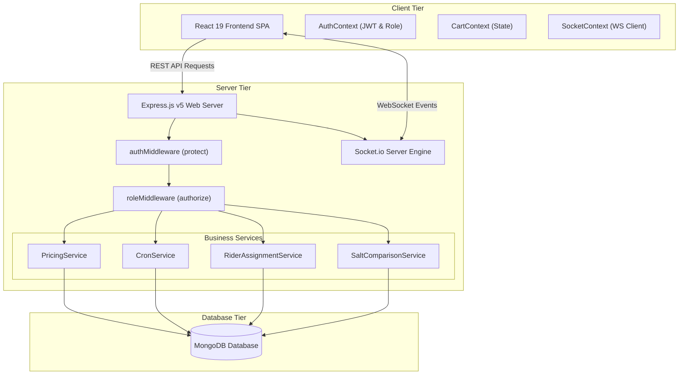
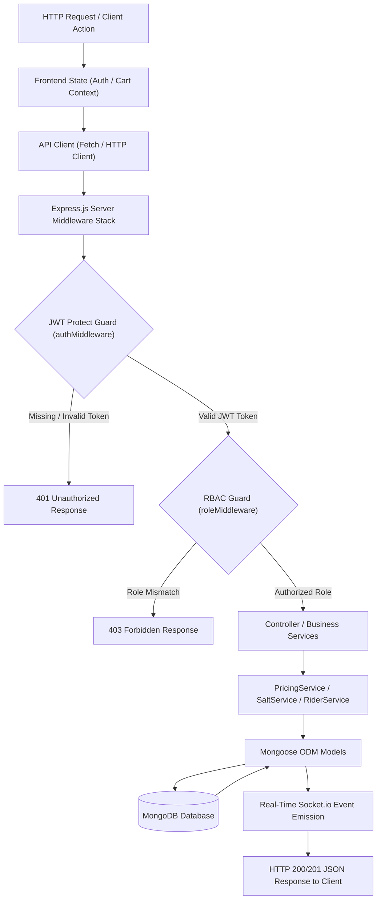
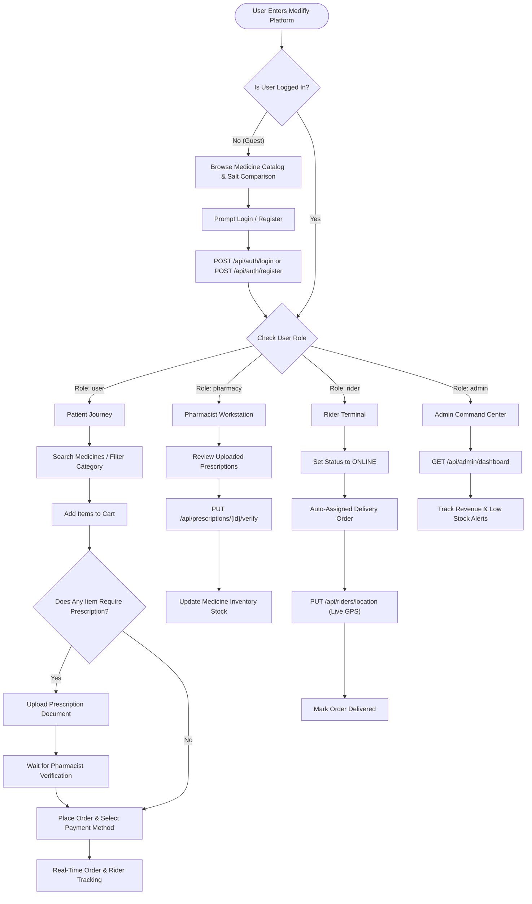
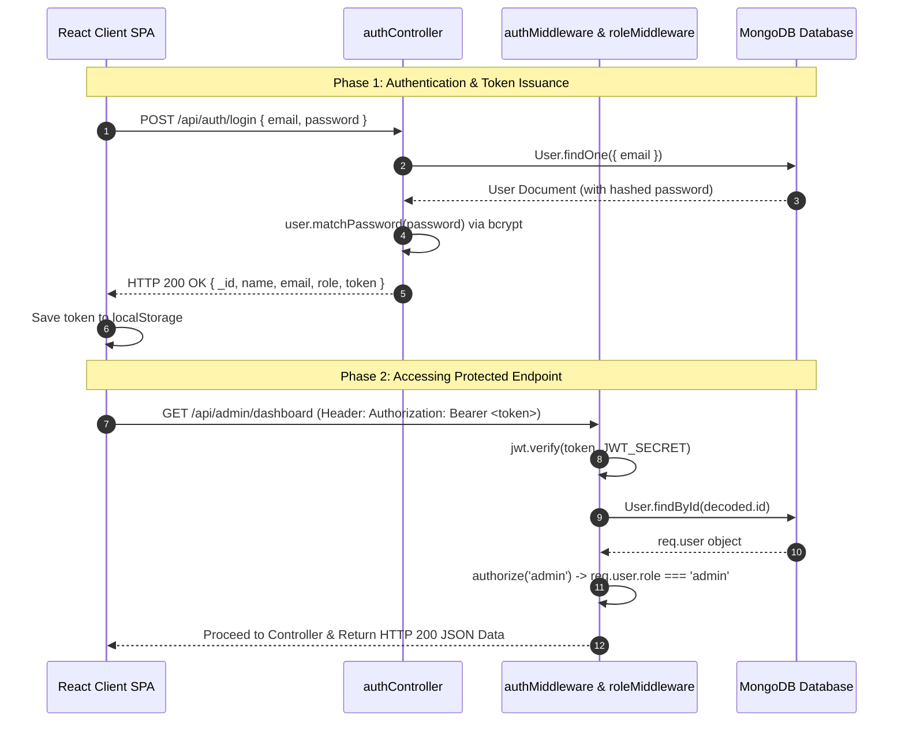
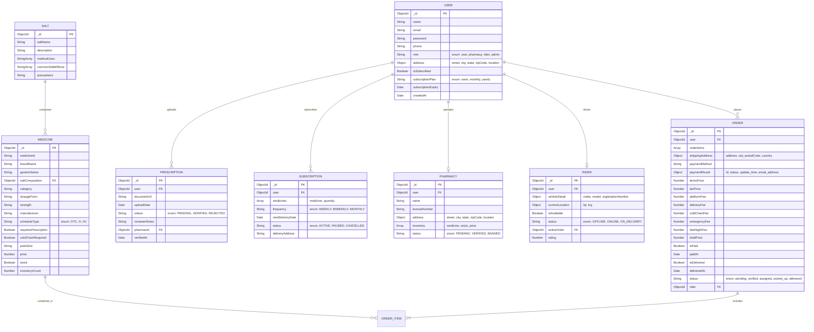

# Medifly — Technical Interview Preparation & Revision Notebook

> **Document Purpose**: Production-grade technical architecture guide, code walkthrough, security analysis, and candidate interview response framework for the **Medifly** Emergency & Subscription Medicine Delivery Platform.

---

## 30-Second Elevator Pitch

"**Medifly** is an enterprise-grade emergency healthcare delivery and automated prescription refill platform built using Node.js **Express v5**, **React 19**, **Vite 6**, **Clerk Authentication & Multi-Tenancy**, and **PostgreSQL (Supabase)**. 

Designed for high-concurrency real-time logistics, Medifly hosts over **254,000+ authentic medicines** with `pg_trgm` GIN trigram indexing, a bioequivalent **Salt Comparison Engine** that automatically matches branded medications with cheaper generic alternatives, a **Prescription Vault** with family member profiles and server-side ownership security checks (`account_owner_id`), a **Multi-Tier Dynamic Pricing Engine** that computes subscriber discounts, cold-chain handling, emergency surcharges, and late-night fees, and an automated **Cron Refill Engine** that manages recurring subscriptions. 

Medifly uses **Socket.io** for real-time inventory alerts, order status tracking, and fleet rider GPS updates, backed by Clerk multi-tenancy authentication and strict **Role-Based Access Control (RBAC)**."

---

## Complete Diagram Suite

### 1. High-Level System Architecture Diagram



---

### 2. System Data Flow Diagram



---

### 3. User Flow & Journey Diagram



---

### 4. JWT Authentication & Security Sequence Diagram



---

### 5. Entity Relationship Diagram (ERD)



---

## Frontend Deep-Dive

### Architecture & Framework
- **React 19 SPA + Vite 6**: Lightweight setup with fast HMR (Hot Module Replacement) and optimized tree-shaking production builds.
- **React Router v7**: Declarative client-side routing mapping paths to dedicated page components (`/medicines`, `/prescriptions`, `/admin`, `/pharmacy`, `/rider`).

### State Providers
1. **`AuthContext`**: Manages persistent authentication state (`localStorage`), role definitions (`user`, `pharmacy`, `rider`, `admin`), login/logout lifecycle, and premium subscription state (`isSubscriber`, `subscriptionPlan`).
2. **`CartContext`**: Maintains in-memory shopping cart items, quantity manipulation, prescription dependency tracking, and local subtotal calculations.
3. **`SocketContext`**: Establishes WebSockets connection via `socket.io-client` on app mount. Subscribes user to personalized room (`joinUserRoom`) and registers listeners for real-time events (`priceChanged`, `inventoryChanged`, `orderStatusChanged`, `riderLocationUpdated`, `prescriptionVerified`).

### UI Design System
- **CSS Modules + HSL Variable Architecture**: Prevents class collision across components. `index.css` defines HSL CSS color variables for primary blue/teal themes, dark mode support, glassmorphic card overlays, and subtle button click micro-animations.

---

## Backend Deep-Dive

### Controller Architecture & Middleware Stack
- **Express v5 Application Server**: Leverages native promise handling in Express v5, simplifying async error catching.
- **Global Error Handler Middleware**: Catches unhandled rejections to ensure the Node.js event loop remains stable:
```javascript
app.use((err, req, res, next) => {
  console.error('Unhandled Error:', err.stack || err.message);
  res.status(err.status || 500).json({
    message: err.message || 'Internal Server Error',
    ...(process.env.NODE_ENV === 'development' && { stack: err.stack })
  });
});
```

### Business Logic Service Layer
1. **`PricingService`**: Encapsulates all pricing calculations:
   - Base Subtotal: `sum(item.price * item.qty)`
   - Tax: `5%` of Subtotal
   - Platform Fee: ₹2.00 (subscribers) vs ₹6.00 (non-subscribers)
   - Delivery Fee: Flat ₹30.00
   - Cold Chain Fee: ₹15.00 (subscribers) vs ₹25.00 (non-subscribers) for items with `coldChainRequired: true`
   - Emergency Surcharge: ₹25.00 (subscribers) vs ₹50.00 (non-subscribers)
   - Late Night Surcharge: ₹0 (subscribers) vs ₹20.00 (non-subscribers) during 10 PM - 6 AM
2. **`CronService`**: Schedules midnight cron runner (`0 0 * * *`) using `node-cron`. Scans `Subscription` collection for due deliveries (`nextDeliveryDate <= today`), generates auto-orders, applies subscriber free shipping, and increments `nextDeliveryDate` according to subscription frequency.
3. **`RiderAssignmentService`**: Identifies online and available riders (`status: 'ONLINE'`, `isAvailable: true`), assigns closest rider to newly created order, and updates rider status to `ON_DELIVERY`.
4. **`SaltComparisonService`**: Filters database by `saltComposition` reference ID to return cheaper generic alternatives sorted ascending by price.

---

## Security Deep-Dive

### 1. Password Hashing (`Bcrypt.js`)
Passwords are encrypted before database insertion using a 10-round salt cost factor:
```javascript
UserSchema.pre('save', async function(next) {
  if (!this.isModified('password')) return next();
  const salt = await bcrypt.genSalt(10);
  this.password = await bcrypt.hash(this.password, salt);
});
```

### 2. Token Generation & Verification
Tokens are signed with `jsonwebtoken` utilizing `JWT_SECRET` and configurable expiry:
```javascript
const generateToken = (id) => {
  return jwt.sign({ id }, process.env.JWT_SECRET, {
    expiresIn: process.env.JWT_EXPIRES_IN || '30d',
  });
};
```

### 3. Middleware Guards (`protect` and `authorize`)
- `protect`: Extracts `Bearer <token>` from HTTP `Authorization` header, verifies signature, fetches user document without password, and assigns to `req.user`.
- `authorize(...roles)`: Verifies `req.user.role` against white-listed role array. Returns `403 Forbidden` if unauthorized.

---

## Complete API Specification Reference

| Endpoint | Method | Role Required | Request Payload Summary | Primary Response |
| :--- | :--- | :--- | :--- | :--- |
| `/api/auth/register` | `POST` | Public | `{ name, email, password, phone }` | `201` `{ _id, name, email, role, token }` |
| `/api/auth/login` | `POST` | Public | `{ email, password }` | `200` `{ _id, name, email, role, token }` |
| `/api/auth/profile` | `GET` | Authenticated | None | `200` User Profile Object |
| `/api/medicines` | `GET` | Public | Query: `keyword`, `pageNumber` | `200` `{ medicines: [...], page, pages }` |
| `/api/medicines/:id` | `GET` | Public | URL Param: `id` | `200` Medicine Object |
| `/api/medicines/salt-comparison/:medicineId` | `GET` | Public | URL Param: `medicineId` | `200` `{ original_medicine, alternative_medicines }` |
| `/api/medicines/:id/price` | `PUT` | Admin/Pharmacy | `{ price: number }` | `200` Updated Medicine + Socket Broadcast |
| `/api/orders` | `POST` | User | `{ orderItems, shippingAddress, paymentMethod, prescriptionId, isEmergency }` | `201` Order Object + Stock Decrement |
| `/api/orders/myorders` | `GET` | User | None | `200` Array of User Orders |
| `/api/orders/:id/pay` | `PUT` | User | Payment Result payload | `200` Updated Order (`isPaid: true`) |
| `/api/prescriptions` | `POST` | User | `{ documentUrl: string }` | `201` Prescription Object (`status: PENDING`) |
| `/api/prescriptions/:id/verify` | `PUT` | Pharmacy/Admin | `{ status: "VERIFIED"|"REJECTED", notes: string }` | `200` Updated Prescription + Socket Notification |
| `/api/subscriptions` | `POST` | User | `{ medicines, frequency, nextDeliveryDate, deliveryAddress }` | `201` Subscription Object |
| `/api/subscriptions` | `GET` | User | None | `200` Array of User Subscriptions |
| `/api/pharmacy` | `POST` | User | `{ name, licenseNumber, address }` | `201` Pharmacy Object |
| `/api/pharmacy/dashboard` | `GET` | Pharmacy/Admin | None | `200` Pharmacy Store Object |
| `/api/riders` | `POST` | User | `{ vehicleDetail }` | `201` Rider Object |
| `/api/riders/location` | `PUT` | Rider | `{ location: { lat, lng } }` | `200` Updated Rider Location + Socket Emission |
| `/api/admin/dashboard` | `GET` | Admin | None | `200` Platform Stats & Low-Stock Alerts |

---

## 7 Core Technical Interview Q&A / Talking Points

### Question 1: Framework Selection Rationale
**Q: Why choose Express.js v5 with Node.js and React 19 over alternatives like FastAPI (Python) or Next.js?**
> **Answer**: 
> Express v5 on Node.js provides non-blocking, event-driven I/O ideal for real-time WebSocket communication via Socket.io. Unlike Next.js server components which add unnecessary SSR hydration complexity for a dynamic dashboard platform, a decoupled React 19 SPA served via Vite offers clean client-side state isolation (`AuthContext`, `CartContext`, `SocketContext`). Node.js allows unified JavaScript/JSON schemas across both frontend and backend layers, speeding up development and execution.

### Question 2: Concurrency & Data Integrity Guards
**Q: How does Medifly handle race conditions, simultaneous stock depletion, and inventory integrity during order creation?**
> **Answer**: 
> During order placement (`POST /api/orders`), Medifly performs inventory checks prior to order instantiation. Upon validation, stock counts are decremented atomically using MongoDB's atomic operator:
> ```javascript
> const updatedMed = await Medicine.findByIdAndUpdate(item.medicine, {
>   $inc: { inventoryCount: -item.qty }
> }, { new: true });
> ```
> Using `$inc` guarantees thread-safe, atomic inventory modification directly inside the database engine without race condition overwrites. Furthermore, if stock drops below 1, WebSocket events immediately notify all browsing clients to disable purchase buttons in real time.

### Question 3: Role-Based Access Control (RBAC) Enforcement
**Q: How is Role-Based Access Control enforced across both frontend and backend layers?**
> **Answer**: 
> Medifly enforces a defense-in-depth security model:
> 1. **Backend Enforcement (Primary)**: Protected Express endpoints chain `protect` (verifies JWT token and attaches user object) with curried `authorize(...roles)` middleware:
> ```javascript
> router.get('/dashboard', protect, authorize('admin'), getDashboardStats);
> ```
> If a user attempts to access an unauthorized endpoint, the middleware immediately aborts execution with `403 Forbidden`.
> 2. **Frontend Enforcement (UX Layer)**: React Router checks `user.role` stored in `AuthContext` to conditionally render navigation items and redirect unauthorized users away from restricted portals (`/admin`, `/pharmacy`, `/rider`).

### Question 4: Domain Model Design & Normalization
**Q: Why separate the `Salt` entity from `Medicine`, and why snapshot prices inside `Order.orderItems`?**
> **Answer**: 
> - **Salt Normalization**: Multiple brand-name medicines (e.g., *Calpol*, *Dolo*, *Pacimol*) share the exact same active chemical formulation (*Paracetamol 650mg*). By creating a separate `Salt` collection and referencing `saltComposition` via MongoDB `ObjectId`, we enable rapid bioequivalent alternative queries (`compareSalts`) sorted by lowest cost.
> - **Price Snapshotting**: Catalog item prices fluctuate over time. Storing `price` directly inside each `orderItems` sub-document at the moment of order placement preserves financial audit accuracy, ensuring historical order totals remain unaffected by future price updates.

### Question 5: TDD Execution Workflow & Code Coverage
**Q: What was your Test-Driven Development (TDD) approach for core business services?**
> **Answer**: 
> Business logic that most needs correctness guarantees — `PricingService`'s fee/tax math, salt-composition matching, cron refill scheduling — is deliberately written as pure, dependency-free functions/classes decoupled from Express and Mongoose. That's what makes it TDD-friendly: no HTTP mocking or DB stubbing needed to test the actual pricing rules. Test cases would cover subscriber fee waivers, late-night surcharges, cold-chain handling, and prescription status checks. `mongodb-memory-server` is already wired into `config/db.js` as a fallback/dev DB, which doubles as the foundation for integration tests later. I haven't written the test suite yet — that's the honest next step, not something I'd claim is done.

### Question 6: Price Snapshotting & Multi-Tier Pricing Engine
**Q: How does the pricing engine calculate multi-tier fees and handle real-time price synchronization?**
> **Answer**: 
> `PricingService` executes a deterministic calculation pipeline considering cart items, user subscription tier (`isSubscribed`), cold-chain flag, time of order (late-night surcharge between 10 PM - 6 AM), and emergency flag. When an admin or pharmacist updates a medicine price via `PUT /api/medicines/:id/price`, the controller updates MongoDB and immediately triggers a Socket.io broadcast (`priceChanged`), alerting active client sessions to reflect the updated price in their carts instantly.

### Question 7: Cloud Deployment Manifests
**Q: How would you deploy Medifly to production cloud infrastructure?**
> **Answer**: 
> Medifly is configured for cloud deployment across modern hosting services:
> - **Frontend SPA**: Deployed to Vercel or Netlify via Vite build (`npm run build`), producing optimized static assets in `dist/`.
> - **Backend Server**: Containerized with Docker and hosted on Render or Railway with WebSocket support enabled.
> - **Database**: Hosted on MongoDB Atlas with multi-region replica sets and automatic index optimization.
> - **Containerization (Docker)**:
> ```dockerfile
> FROM node:18-alpine
> WORKDIR /app
> COPY backend/package*.json ./
> RUN npm ci --only=production
> COPY backend/ .
> EXPOSE 5000
> CMD ["node", "server.js"]
> ```
