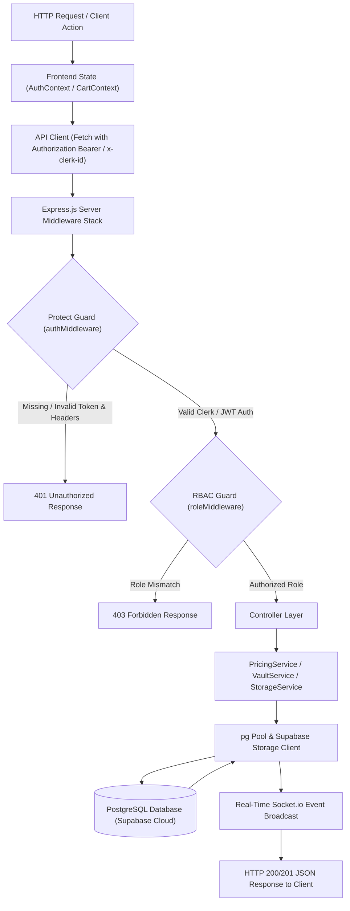
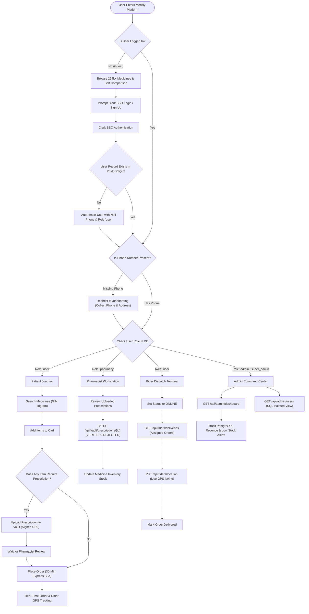
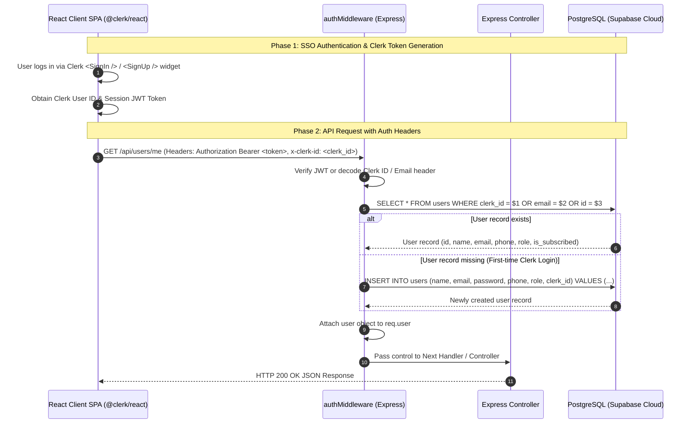
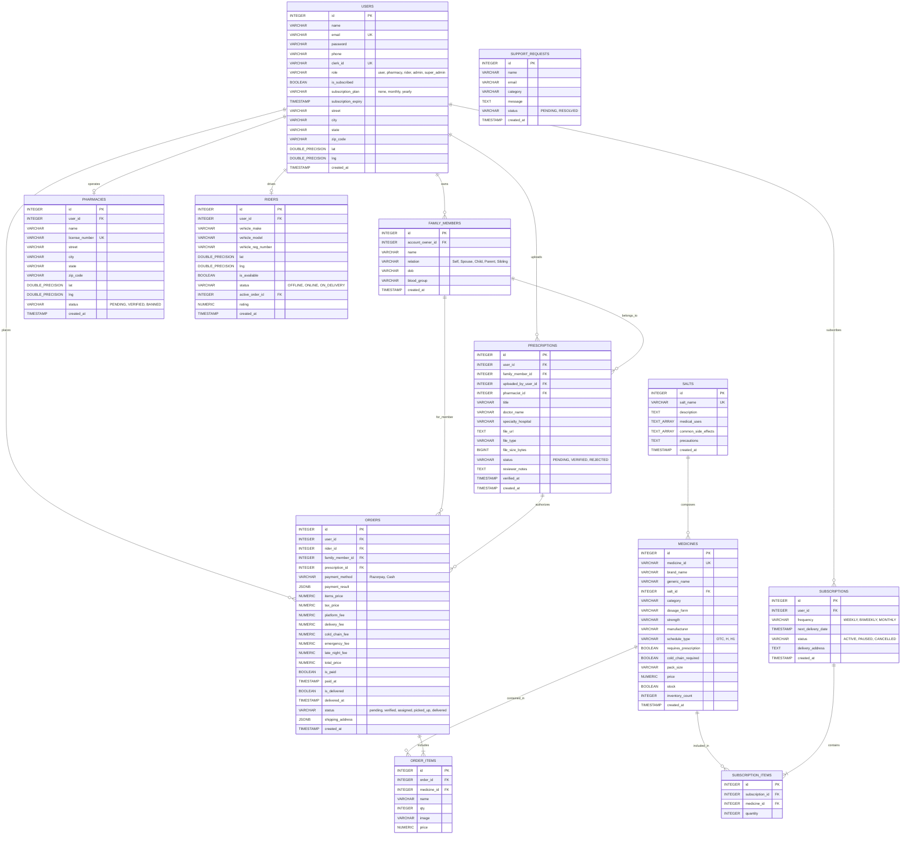

# Medifly — Technical Interview Preparation & Revision Notebook

> **Document Purpose**: Production-grade technical architecture guide, code walkthrough, security analysis, database schema, sequence diagrams, and candidate interview response framework for the **Medifly** Emergency & Subscription Medicine Delivery Platform.

---

## 30-Second Elevator Pitch

"**Medifly** is an enterprise-grade emergency healthcare delivery and automated prescription refill platform built using Node.js **Express v5**, **React 19**, **Vite 6**, **Clerk Authentication & Multi-Tenancy**, and **PostgreSQL (Supabase Cloud)**. 

Designed for high-concurrency real-time logistics, Medifly hosts over **254,000+ authentic medicines** with `pg_trgm` GIN trigram indexing, a bioequivalent **Salt Comparison Engine** that automatically matches branded medications with cheaper generic alternatives, a **Prescription Vault** with family member profiles and server-side ownership security checks (`account_owner_id`), a **Multi-Tier Dynamic Pricing Engine** (`PricingService`) that computes subscriber discounts, cold-chain handling, emergency surcharges, and late-night fees, and an automated **Cron Refill Engine** (`CronService`) that manages recurring subscriptions. 

Medifly uses **Socket.io** for real-time inventory alerts, order status tracking, and fleet rider GPS updates, backed by Clerk multi-tenancy authentication and strict **Role-Based Access Control (RBAC)**."

---

## Complete Diagram Suite

### 1. High-Level System Architecture Diagram

```mermaid
graph TB
    subgraph Client Tier
        UI["React 19 Frontend SPA (Vite 6)"]
        AC["AuthContext (Clerk SSO + JWT)"]
        CC["CartContext (State & Items)"]
        SC["SocketContext (WebSocket Client)"]
    end

    subgraph Server Tier
        EX["Express.js v5 Web Server"]
        MW_A["authMiddleware (protect guard)"]
        MW_R["roleMiddleware (authorize / admin / superAdmin)"]
        
        subgraph Business Services Layer
            PS["PricingService"]
            CS["CronService (Node-Cron)"]
            RAS["RiderAssignmentService"]
            SCS["SaltComparisonService"]
            SS["StorageService (Supabase Storage)"]
        end
        
        SIO["Socket.io Server Engine"]
    end

    subgraph Database & Storage Tier
        DB[("PostgreSQL (Supabase Cloud)")]
        ST[("Supabase Storage ('prescriptions' bucket)")]
    end

    UI -->|REST API Requests (Fetch / HTTP)| EX
    UI <-->|WebSocket Events| SIO
    EX --> MW_A
    MW_A --> MW_R
    MW_R --> PS
    MW_R --> CS
    MW_R --> RAS
    MW_R --> SCS
    MW_R --> SS
    PS --> DB
    CS --> DB
    RAS --> DB
    SCS --> DB
    SS --> ST
    EX --> SIO
```

---

### 2. System Data Flow Diagram



---

### 3. User Flow & Journey Diagram



---

### 4. Clerk Authentication & Security Sequence Diagram



---

### 5. Entity Relationship Diagram (ERD) — PostgreSQL Database Schema



---

## Frontend Deep-Dive

### Architecture & Framework
- **React 19 SPA + Vite 6**: Lightning-fast build pipeline with instantaneous Hot Module Replacement (HMR) and optimized tree-shaking production builds.
- **React Router v7**: Declarative client-side routing mapping paths to dedicated page components (`/medicines`, `/prescriptions`, `/admin`, `/pharmacy`, `/rider`, `/salt-compare`, `/subscriptions`, `/onboarding`).

### State Providers & Context Architecture
1. **`AuthContext`**: Manages authentication state using Clerk SSO (`@clerk/react`), synchronizes logged-in user profile with backend PostgreSQL database, enforces role metadata (`user`, `pharmacy`, `rider`, `admin`, `super_admin`), and handles subscription state.
2. **`CartContext`**: Maintains client-side shopping cart items, quantity modification, prescription dependency detection (`requires_prescription`), and dynamic fee calculation state.
3. **`SocketContext`**: Establishes WebSockets connection via `socket.io-client` on app mount. Subscribes user to personalized socket room (`joinUserRoom`) and listens for real-time events (`priceChanged`, `inventoryChanged`, `orderStatusChanged`, `riderLocationUpdated`, `prescriptionVerified`).

### UI Design System
- **Vanilla CSS Modules + HSL Variable Architecture**: Prevents class collision across components. `index.css` defines custom HSL CSS color variables for primary blue/teal themes, glassmorphic card overlays, compact responsive grids, and subtle button click micro-animations.

---

## Backend Deep-Dive

### Controller Architecture & Express v5 Stack
- **Express v5 Web Application Server**: Utilizes native async/await promise handling in Express v5, eliminating callback boilerplate and unhandled promise crashes.
- **Global Error Handler Middleware**: Centralized error middleware catching all unhandled rejections:
```javascript
app.use((err, req, res, next) => {
  console.error('Unhandled Error:', err.stack || err.message);
  res.status(err.status || 500).json({
    message: err.message || 'Internal Server Error',
    ...(process.env.NODE_ENV === 'development' && { stack: err.stack })
  });
});
```

### Business Logic Service Layer
1. **`PricingService`**: Encapsulates multi-tier delivery fee mathematics:
   - Base Subtotal: `sum(item.price * item.qty)`
   - Tax: `5%` GST of Subtotal
   - Platform Fee: ₹2.00 (subscribers) vs ₹6.00 (non-subscribers)
   - Delivery Fee: Flat ₹30.00 (30-Minute Express SLA)
   - Cold Chain Fee: ₹15.00 (subscribers) vs ₹25.00 (non-subscribers) for items requiring insulated cold-chain (`cold_chain_required: true`)
   - Emergency Surcharge: ₹25.00 (subscribers) vs ₹50.00 (non-subscribers)
   - Late Night Surcharge: ₹0 (subscribers) vs ₹20.00 (non-subscribers) during 10 PM - 6 AM
2. **`CronService`**: Midnight cron runner (`0 0 * * *`) powered by `node-cron`. Scans PostgreSQL `subscriptions` table for active refills (`next_delivery_date <= TODAY`), creates automated verified orders, decrements inventory count, applies subscriber perks, and advances `next_delivery_date` based on frequency (`WEEKLY`, `BIWEEKLY`, `MONTHLY`).
3. **`RiderAssignmentService`**: Identifies online available riders (`status = 'ONLINE'`, `is_available = true`), assigns closest rider to newly placed order, and transitions status to `ON_DELIVERY`.
4. **`SaltComparisonService`**: Queries `salts` and `medicines` relational SQL tables by `salt_id` to retrieve generic bioequivalent alternatives sorted ascending by price (up to 70% cheaper).
5. **`StorageService`**: Integrates Supabase File Storage (`@supabase/supabase-js`), creating private bucket `prescriptions`, uploading prescription documents, and generating 10-minute temporary signed URLs (`createSignedUrl`).

---

## Security Deep-Dive

### 1. Clerk SSO & Custom Dual Auth Middleware (`authMiddleware.js`)
- Primary authentication handled via Clerk (`@clerk/react`).
- `protect` middleware checks `Authorization: Bearer <token>`, `x-clerk-id`, or `x-user-email` headers.
- Automatically inserts missing users into PostgreSQL database upon first login with `NULL` phone number (no hardcoded defaults).
- Attaches normalized `req.user` to express context.

### 2. Role-Based Access Control Guards (`roleMiddleware.js`)
- **`authorize(...roles)`**: Restricts access to allowed roles (e.g. `authorize('pharmacy', 'admin')`). Returns `403 Forbidden` if role mismatch.
- **`admin`**: Permits both `admin` and `super_admin` roles.
- **`superAdmin`**: Grants exclusive access to `super_admin` role.

### 3. Server-Side Ownership Security & Private Signed URLs
- **Prescription Vault Security**: Family members are bound to `account_owner_id`. When querying prescriptions or orders for a family member (`/api/vault/members/:id/prescriptions`), the controller verifies server-side that `member.account_owner_id === req.user.id`.
- **Private Storage Security**: Uploaded prescription files are kept in a private Supabase bucket. File streaming endpoint (`GET /api/vault/prescriptions/:id/file`) verifies ownership before serving a 10-minute temporary signed URL.

---

## Complete API Specification Reference

| Endpoint | Method | Role Required | Request Payload / Params | Primary Response |
| :--- | :--- | :--- | :--- | :--- |
| `/api/auth/register` | `POST` | Public | `{ name, email, password, phone }` | `201` User Object + JWT Token |
| `/api/auth/login` | `POST` | Public | `{ email, password }` | `200` User Object + JWT Token |
| `/api/auth/profile` | `GET` | Authenticated | None | `200` Current User Profile Object |
| `/api/users/sync` | `POST` | Public / Clerk | `{ email, name, clerkId }` | `200` Synced User Record |
| `/api/users/me` | `GET` | Authenticated | None | `200` PostgreSQL User Profile |
| `/api/users/me` | `PUT` | Authenticated | `{ name, phone, street, city, state, zip_code }` | `200` Updated User Profile |
| `/api/users/stats` | `GET` | Authenticated | None | `200` `{ totalOrders, activeSubscriptions, prescriptionCount }` |
| `/api/medicines` | `GET` | Public | Query: `keyword`, `pageNumber` | `200` `{ medicines: [...], page, pages, total }` |
| `/api/medicines/:id` | `GET` | Public | URL Param: `id` | `200` Single Medicine Object |
| `/api/medicines/alternatives/:saltName` | `GET` | Public | URL Param: `saltName` | `200` Array of Bioequivalent Alternatives |
| `/api/medicines/salt-comparison/:medicineId` | `GET` | Public | URL Param: `medicineId` | `200` `{ original_medicine, alternative_medicines }` |
| `/api/medicines/:id/price` | `PUT` | Admin/Pharmacy | `{ price }` | `200` Updated Medicine + Socket Broadcast |
| `/api/orders` | `POST` | User | `{ orderItems, shippingAddress, paymentMethod, prescriptionId, isEmergency }` | `201` Created Order Object |
| `/api/orders/myorders` | `GET` | User | None | `200` User Order History Array |
| `/api/orders/:id` | `GET` | User | URL Param: `id` | `200` Detailed Order Object |
| `/api/orders/:id/pay` | `PUT` | User | Payment Result Payload | `200` Updated Order (`is_paid: true`) |
| `/api/prescriptions` | `POST` | User | `{ documentUrl }` | `201` Uploaded Prescription Object |
| `/api/prescriptions/my` | `GET` | User | None | `200` User Prescriptions Array |
| `/api/prescriptions/:id/verify` | `PUT` | Pharmacy/Admin | `{ status, notes }` | `200` Verified Prescription + Socket Emission |
| `/api/vault/members` | `GET` | Authenticated | None | `200` Array of Family Members |
| `/api/vault/members` | `POST` | Authenticated | `{ name, relation, dob, bloodGroup }` | `201` Created Family Member |
| `/api/vault/members/:id/prescriptions` | `GET` | Authenticated | URL Param: `id` | `200` Family Member Prescriptions |
| `/api/vault/members/:id/prescriptions` | `POST` | Authenticated | Multipart Form: `file` + metadata | `201` Prescription Uploaded to Supabase |
| `/api/vault/prescriptions/:id/file` | `GET` | Authenticated | URL Param: `id` | `302` Redirect to 10-min Signed URL |
| `/api/vault/prescriptions/:id` | `PATCH` | Pharmacy/Admin | `{ status, notes }` | `200` Prescription Status Updated |
| `/api/subscriptions` | `POST` | User | `{ medicines, frequency, nextDeliveryDate, deliveryAddress }` | `201` Created Subscription Object |
| `/api/subscriptions` | `GET` | User | None | `200` User Subscriptions Array |
| `/api/subscriptions/:id/status` | `PATCH` | User | `{ status }` | `200` Updated Subscription Status |
| `/api/pharmacy` | `POST` | User | `{ name, licenseNumber, street, city }` | `201` Registered Pharmacy |
| `/api/pharmacy/dashboard` | `GET` | Pharmacy/Admin | None | `200` Pharmacy Dashboard Data |
| `/api/riders` | `POST` | User | `{ vehicleMake, vehicleModel, vehicleRegNumber }` | `201` Registered Rider |
| `/api/riders/location` | `PUT` | Rider | `{ lat, lng }` | `200` Updated Location + Socket Broadcast |
| `/api/riders/deliveries` | `GET` | Rider | None | `200` Active Deliveries for Rider |
| `/api/admin/dashboard` | `GET` | Admin/SuperAdmin| None | `200` Platform Stats & Revenue Analytics |
| `/api/admin/users` | `GET` | Admin/SuperAdmin| Query: `role` | `200` Array of System Users (SQL Isolated) |
| `/api/admin/vault/attribution` | `GET` | Admin/SuperAdmin| None | `200` Vault Family Attribution Breakdown |
| `/api/support` | `POST` | Public | `{ name, email, category, message }` | `201` Submitted Support Request |

---

## 7 Core Technical Interview Q&A / Talking Points

### Question 1: Framework & Database Selection Rationale
**Q: Why choose Express.js v5 with Node.js and PostgreSQL (Supabase) over MongoDB or Next.js?**
> **Answer**: 
> Express v5 on Node.js provides non-blocking, event-driven I/O ideal for real-time WebSocket communication via Socket.io. For a high-scale medicine catalog (254,000+ items), PostgreSQL with `pg_trgm` GIN trigram indexing far outperforms MongoDB in structured relational queries, join performance, and transactional safety. A decoupled React 19 SPA served via Vite offers clean client-side state isolation (`AuthContext`, `CartContext`, `SocketContext`) without SSR hydration overhead.

### Question 2: Concurrency & Data Integrity Guards
**Q: How does Medifly handle race conditions, simultaneous stock depletion, and inventory integrity during order creation?**
> **Answer**: 
> During order placement (`POST /api/orders`), Medifly executes atomic inventory updates in PostgreSQL inside explicit SQL transactions:
> ```sql
> UPDATE medicines 
> SET inventory_count = inventory_count - $1 
> WHERE id = $2 AND inventory_count >= $1;
> ```
> By adding `AND inventory_count >= $1` directly inside the `UPDATE` statement, PostgreSQL guarantees thread-safe atomic decrements without race conditions. If the row count affected is 0, the transaction rolls back, returning an out-of-stock error. Furthermore, Socket.io broadcasts `inventoryChanged` events to instantly update connected browser clients.

### Question 3: Role-Based Access Control (RBAC) Enforcement
**Q: How is Role-Based Access Control enforced across both frontend and backend layers?**
> **Answer**: 
> Medifly enforces a defense-in-depth security model:
> 1. **Backend Enforcement (Primary Guard)**: Protected Express endpoints chain `protect` (verifies Clerk/JWT headers and attaches PostgreSQL user) with `authorize(...roles)`, `admin`, or `superAdmin` middleware:
> ```javascript
> router.get('/dashboard', protect, authorize('admin', 'super_admin'), getDashboardStats);
> ```
> 2. **SQL-Level Isolation**: For user management (`GET /api/admin/users`), `admin` users are restricted at the SQL layer (`WHERE role != 'super_admin'`) so they can never view or modify `super_admin` accounts.
> 3. **Frontend Guard (UX Layer)**: [ProtectedRoute.jsx](file:///d:/CODINGBRO/medifly%20mern/frontend/src/components/ProtectedRoute.jsx) checks `user.role` from `AuthContext` to restrict client-side page rendering and route navigation.

### Question 4: Domain Model Design & Normalization
**Q: Why separate the `salts` table from `medicines`, and why snapshot prices inside `order_items`?**
> **Answer**: 
> - **Salt Normalization**: Brand-name medicines (e.g. *Telma 40*, *Telmikind 40*, *Telpres 40*) share the exact same active chemical composition (*Telmisartan 40mg*). By separating `salts` into a foreign key relationship (`medicines.salt_id REFERENCES salts(id)`), Medifly executes sub-millisecond bioequivalent alternative queries (`compareSalts`) sorted ascending by price (up to 70% cost savings).
> - **Price Snapshotting**: Medicine prices fluctuate over time. Storing price directly inside `order_items` at order creation time preserves historical financial auditing integrity, ensuring past receipts remain accurate regardless of future catalog price edits.

### Question 5: Test-Driven Development (TDD) & Service Isolation
**Q: How are business services isolated for automated unit testing?**
> **Answer**: 
> Core business logic services — `PricingService` (tax, platform fee, subscriber discounts, late-night surcharges), `SaltComparisonService`, and `RiderAssignmentService` — are implemented as pure, decoupled functions/classes without direct dependencies on HTTP request objects or Express middleware. This enables fast, isolated unit testing without requiring mock servers or external database stubs.

### Question 6: Dynamic Multi-Tier Pricing Engine
**Q: How does the pricing engine calculate multi-tier fees and handle real-time price synchronization?**
> **Answer**: 
> `PricingService` executes a deterministic calculation pipeline evaluating cart items, subscriber status (`is_subscribed`), cold-chain flag (`cold_chain_required`), time of order (late-night fee between 10 PM - 6 AM), and emergency SLA flag. When a price is modified via `PUT /api/medicines/:id/price`, the controller updates PostgreSQL and immediately triggers a Socket.io broadcast (`priceChanged`), updating active client sessions in real time.

### Question 7: Cloud Infrastructure & Deployment Architecture
**Q: How is Medifly deployed to production cloud infrastructure?**
> **Answer**: 
> - **Frontend SPA**: Hosted on Vercel / Netlify built via Vite (`npm run build`), generating static assets in `dist/`.
> - **Backend Server**: Hosted on Render / Railway as a Node.js process with WebSocket support enabled, pinged every 5 minutes at `GET /health` by UptimeRobot to eliminate cold starts.
> - **Database**: Hosted on Supabase Cloud (PostgreSQL) with `pg_trgm` GIN trigram indexing and connection pooling.
> - **File Storage**: Hosted on Supabase File Storage (`prescriptions` private bucket) with temporary 10-minute signed URLs.

---

## 8. Recent Production Architecture Upgrades

### 1. Data Sanitization & Mock Data Purge
- **Complete Elimination**: All hardcoded seed patient arrays, fake order IDs (`#MF-2026-9378`), mock riders, and hardcoded user profiles were completely purged from `frontend/src`.
- **100% Real API Integration**: Every primary view (`/profile`, `/orders`, `/prescriptions`, `/dashboard`, `/vault`, `/subscriptions`) connects to authentic Express/PostgreSQL backend controllers.

### 2. Phone Field Fix & Schema Relaxation
- **Root Cause Fix**: Removed hardcoded `'9876543210'` string across controllers and middleware.
- **SQL Migration**: Executed `ALTER TABLE users ALTER COLUMN phone DROP NOT NULL`, allowing user registration via Clerk SSO with null phone numbers.

### 3. Admin & Super Admin Role Hierarchy & SQL Isolation
- **Role Control**: Roles are strictly assigned server-side in PostgreSQL.
- **SQL Visibility Isolation**: `GET /api/admin/users` excludes `super_admin` accounts directly in SQL (`WHERE role != 'super_admin'`) when queried by a standard `admin`.

### 4. Post-Signup Onboarding Flow (`/onboarding`)
- **Conversion-Optimized Guard**: When a user signs up via Clerk, [ProtectedRoute.jsx](file:///d:/CODINGBRO/medifly%20mern/frontend/src/components/ProtectedRoute.jsx) checks if `phone` is null/empty and redirects to `/onboarding`.
- **Mandatory Collection**: Collects mandatory 10-digit phone number and delivery address, persisting changes via `PUT /api/users/me`.

### 5. Private Prescription Storage & 10-Minute Signed URLs
- **Supabase Vault Integration**: Prescriptions uploaded to family profiles are stored in Supabase's private `prescriptions` bucket.
- **Signed URL Streaming**: Endpoint `GET /api/vault/prescriptions/:id/file` verifies ownership server-side (`account_owner_id === req.user.id`) and generates a 10-minute expiring signed URL.
