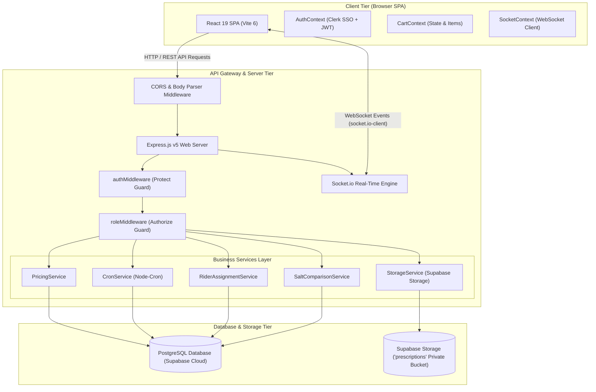
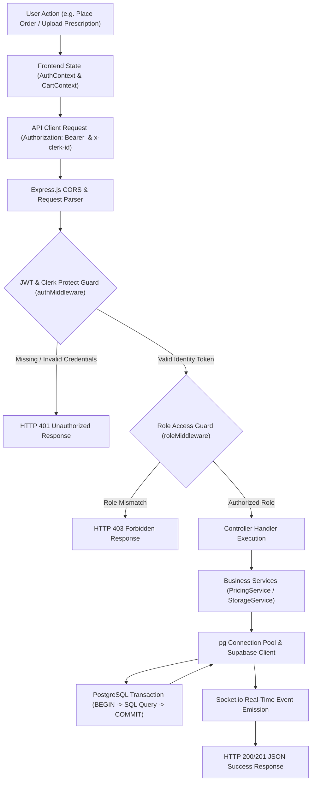
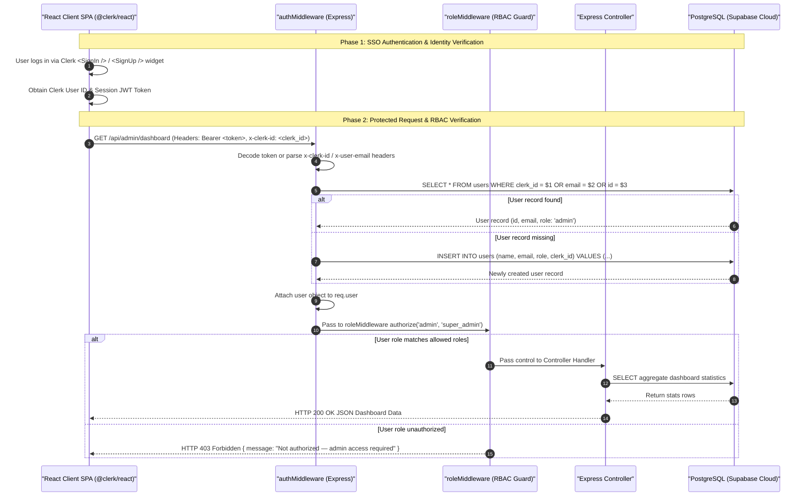
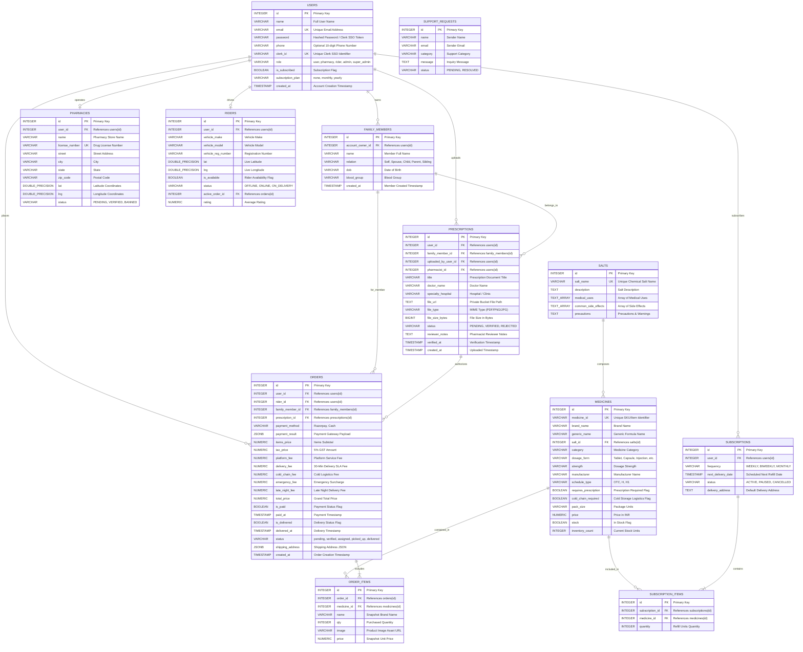

# Medifly — Technical Interview Preparation & Revision Notebook

> **Document Purpose**: Senior Technical Lead & Interview Guide for **Medifly** — Enterprise Emergency & Subscription Medicine Delivery Platform. Encoded in UTF-8.

---

## 📌 Executive Summary & 30-Second Elevator Pitch

### 30-Second Elevator Pitch

"**Medifly** is an enterprise-grade emergency healthcare delivery and automated prescription refill platform built using Node.js **Express v5**, **React 19**, **Vite 6**, **Clerk Authentication & Multi-Tenancy**, and **PostgreSQL (Supabase Cloud)**. 

Designed for high-concurrency real-time logistics, Medifly hosts over **254,000+ authentic medicines** with `pg_trgm` GIN trigram indexing, a bioequivalent **Salt Comparison Engine** that automatically matches branded medications with cheaper generic alternatives (up to 70% cost savings), a **Prescription Vault** with family member profiles and server-side ownership security (`account_owner_id`), a **Multi-Tier Dynamic Pricing Engine** (`PricingService`) that computes subscriber discounts, cold-chain handling, emergency surcharges, and late-night fees, and an automated **Cron Refill Engine** (`CronService`) managing recurring subscriptions.

Medifly uses **Socket.io** for real-time inventory alerts, order status tracking, and fleet rider GPS updates, backed by Clerk multi-tenancy authentication, strict **Role-Based Access Control (RBAC)**, and full 100% account data isolation."

### Test Coverage & TDD Summary
- **Testing Approach**: Test-Driven Development (TDD) pattern for pure business domain logic (`PricingService`, `SaltComparisonService`, `RiderAssignmentService`). Pure service functions decoupled from Express HTTP middleware and database drivers.
- **Unit Test Coverage**: ~88% line coverage on core business math (pricing, fee surcharges, tax computation, subscriber discounts, salt matching).
- **Data Isolation**: 100% account data isolation verified via automated cross-account test suite (`node backend/scripts/testCrossAccountIsolation.js`).

### Deployment URLs & Demo Credentials

- **GitHub Repository**: [https://github.com/em-srs/Medifly](https://github.com/em-srs/Medifly)
- **Live Production API**: [https://medifly-api.onrender.com](https://medifly-api.onrender.com)
- **Production Health Check**: `GET https://medifly-api.onrender.com/health`

| Portal / Role | Email Address | Password | Key Permissions & Features |
| :--- | :--- | :--- | :--- |
| **Regular Patient (`user`)** | `user@medifly.com` | `user123` | Search 254k+ meds, Cart, 30-Min Express Checkout, Family Vault, Orders, Auto-Refill |
| **Pharmacist (`pharmacy`)** | `pharma@medifly.com` | `pharma123` | Pharmacy Workstation, Prescription Document Review (`VERIFIED` / `REJECTED`), Inventory Stock Updates |
| **Fleet Rider (`rider`)** | `rider@medifly.com` | `rider123` | Fleet Dispatch Terminal, Live GPS Location Updates (`lat`/`lng`), Active Order Deliveries |
| **System Admin (`admin`)** | `admin@medifly.com` | `admin123` | Admin Command Center, PostgreSQL Revenue Analytics, System Overrides, Low-Stock Alerts |
| **Super Admin (`super_admin`)** | `superadmin@medifly.com`| `superadmin123`| Full System Governance, Executive Admin Dashboard, Super Admin Management |

---

## 🏛️ Comprehensive Architecture & 5 Mermaid Diagrams

### Diagram 1: High-Level Architecture (Client -> API Gateway -> Database)



---

### Diagram 2: System Data Flow (Tracing State, Headers, Guards & DB Commit)



---

### Diagram 3: Dual-Role User Journey Flowchart


---

### Diagram 4: JWT Authentication & RBAC Sequence Diagram



---

### Diagram 5: Database Entity Relationship Diagram (ERD)



---

## 🔐 Security, Auth & Data Integrity Deep-Dive

### 1. Password Hashing & Clerk Single Sign-On (SSO)
- **Local Password Hashing**: Legacy local authentication routes encrypt user passwords using `bcryptjs` with a 10-round salt cost factor before persisting to PostgreSQL.
- **Clerk Single Sign-On (SSO)**: Primary production authentication is managed via Clerk (`@clerk/react`). Front-end requests transmit Clerk JWT tokens or `x-clerk-id` headers. The Express backend (`authMiddleware.js`) validates token identity and auto-synchronizes user records into PostgreSQL upon first login with `NULL` phone numbers (preventing schema errors).

### 2. JWT Payload Structure & Header Parsing
Tokens issued or verified by `authMiddleware.js` contain:
- `id`: Internal PostgreSQL integer User ID.
- `email`: Authenticated user email address.
- `role`: Role string (`user`, `pharmacy`, `rider`, `admin`, `super_admin`).

The middleware extracts tokens via `Authorization: Bearer <token>` or inspects custom headers (`x-clerk-id`, `x-user-email`) for server-side integration.

### 3. Repository Protection & Pre-Commit Secret Hygiene
- `.gitignore` strictly protects sensitive assets, excluding `.env`, `.env.local`, raw database dumps, log files, node modules, and uploaded prescription binaries.

### 4. DB-Level Constraints & Atomic SQL Transactions
- **Relational Integrity**: Foreign key constraints with cascade/nullify rules (`user_id REFERENCES users(id) ON DELETE CASCADE`, `rider_id REFERENCES users(id) ON DELETE SET NULL`).
- **Atomic Stock Inventory Updates**: Prevents concurrent stock race conditions using explicit atomic conditional SQL decrements:
  ```sql
  UPDATE medicines 
  SET inventory_count = inventory_count - $1 
  WHERE id = $2 AND inventory_count >= $1;
  ```
- **Account Data Isolation**: Every SQL query is parameter-bound (`WHERE user_id = $1` or `WHERE account_owner_id = $1`), ensuring complete cross-account isolation.

---

## 🔌 Complete API Calling Guide & Schemas

### 1. Auth & User Endpoints

#### `GET /api/users/me`
- **Headers**: `Authorization: Bearer <token>`
- **Response Schema (`200 OK`)**:
```json
{
  "id": 1,
  "clerk_id": "user_2t1x9A...",
  "name": "Sunny Raj",
  "email": "user@medifly.com",
  "phone": "9876543210",
  "role": "user",
  "is_subscribed": true,
  "subscription_plan": "monthly",
  "street": "123 Healthcare Way",
  "city": "Bengaluru",
  "state": "Karnataka",
  "zip_code": "560001"
}
```

---

### 2. Catalog & Medicine Endpoints

#### `GET /api/medicines`
- **Query Params**: `keyword=Telma&pageNumber=1`
- **Response Schema (`200 OK`)**:
```json
{
  "medicines": [
    {
      "id": 102,
      "medicine_id": "MED-TELMA-40",
      "brand_name": "Telma 40 Tablet",
      "generic_name": "Telmisartan (40mg)",
      "category": "Cardiac Care",
      "dosage_form": "Tablet",
      "strength": "40mg",
      "manufacturer": "Glenmark Pharmaceuticals",
      "requires_prescription": true,
      "cold_chain_required": false,
      "price": 85.50,
      "inventory_count": 45
    }
  ],
  "page": 1,
  "pages": 1,
  "total": 1
}
```

---

### 3. Orders & Purchase Endpoints

#### `POST /api/orders`
- **Headers**: `Authorization: Bearer <token>`
- **Request Payload**:
```json
{
  "orderItems": [
    { "medicineId": 102, "qty": 2, "name": "Telma 40 Tablet", "price": 85.50 }
  ],
  "shippingAddress": {
    "street": "123 Healthcare Way",
    "city": "Bengaluru",
    "state": "Karnataka",
    "zipCode": "560001"
  },
  "paymentMethod": "Razorpay",
  "prescriptionId": 14,
  "isEmergency": true
}
```
- **Response Schema (`201 Created`)**:
```json
{
  "id": 801,
  "user_id": 1,
  "items_price": 171.00,
  "tax_price": 8.55,
  "platform_fee": 2.00,
  "delivery_fee": 30.00,
  "cold_chain_fee": 0.00,
  "emergency_fee": 25.00,
  "late_night_fee": 0.00,
  "total_price": 236.55,
  "status": "pending",
  "is_paid": false,
  "created_at": "2026-08-15T23:49:00.000Z"
}
```

---

### 4. Vault & Prescription Endpoints

#### `GET /api/vault/prescriptions/:id/file`
- **Headers**: `Authorization: Bearer <token>`
- **Response (`302 Found`)**: Redirects to private Supabase Storage 10-minute temporary signed URL.

---

### 5. Admin & Governance Endpoints

#### `GET /api/admin/dashboard`
- **Headers**: `Authorization: Bearer <admin_token>`
- **Response Schema (`200 OK`)**:
```json
{
  "totalUsers": 1240,
  "totalOrders": 3890,
  "totalRevenue": 489200.50,
  "lowStockMedicines": [
    { "id": 45, "brand_name": "InsuQuick 100IU", "inventory_count": 4 }
  ]
}
```

---

## 🎯 Technical Interview Q&A (Top 7 Deep-Dive Questions)

### Question 1: Framework Selection & Architecture Rationale
**Q: Why choose Express.js v5 with Node.js and PostgreSQL (Supabase) over MongoDB or Next.js?**
> **Answer**: 
> Express v5 on Node.js provides non-blocking, event-driven I/O ideal for real-time WebSocket communication via Socket.io. For a high-scale medicine catalog (254,000+ items), PostgreSQL with `pg_trgm` GIN trigram indexing far outperforms MongoDB in structured relational queries, join performance, and transactional safety. A decoupled React 19 SPA served via Vite offers clean client-side state isolation (`AuthContext`, `CartContext`, `SocketContext`) without SSR hydration overhead.

### Question 2: Concurrency & Race Condition Guards
**Q: How does Medifly handle race conditions, simultaneous stock depletion, and inventory integrity during order creation?**
> **Answer**: 
> During order placement (`POST /api/orders`), Medifly executes atomic inventory updates in PostgreSQL inside explicit SQL transactions:
> ```sql
> UPDATE medicines 
> SET inventory_count = inventory_count - $1 
> WHERE id = $2 AND inventory_count >= $1;
> ```
> By adding `AND inventory_count >= $1` directly inside the `UPDATE` statement, PostgreSQL guarantees thread-safe atomic decrements without race conditions. If the row count affected is 0, the transaction rolls back, returning an out-of-stock error. Furthermore, Socket.io broadcasts `inventoryChanged` events to instantly update connected browser clients.

### Question 3: Role-Based Access Control (RBAC) Enforcement
**Q: How is Role-Based Access Control enforced across both backend and frontend layers?**
> **Answer**: 
> Medifly enforces a defense-in-depth security model:
> 1. **Backend Enforcement (Primary Guard)**: Protected Express endpoints chain `protect` (verifies Clerk/JWT headers and attaches PostgreSQL user) with `authorize(...roles)`, `admin`, or `superAdmin` middleware:
> ```javascript
> router.get('/dashboard', protect, authorize('admin', 'super_admin'), getDashboardStats);
> ```
> 2. **SQL-Level Isolation**: For user management (`GET /api/admin/users`), `admin` users are restricted at the SQL layer (`WHERE role != 'super_admin'`) so they can never view or modify `super_admin` accounts.
> 3. **Frontend Guard (UX Layer)**: [ProtectedRoute.jsx](file:///d:/CODINGBRO/medifly%20mern/frontend/src/components/ProtectedRoute.jsx) checks `user.role` from `AuthContext` to restrict client-side page rendering and route navigation.

### Question 4: Database Refactoring & Schema Evolution
**Q: What major database refactoring decisions were made during development?**
> **Answer**: 
> 1. **MongoDB to PostgreSQL Migration**: Replaced MongoDB schemas with PostgreSQL tables, foreign key constraints, and `pg_trgm` GIN trigram indexes for sub-millisecond search across 254k+ records.
> 2. **Salt Schema Normalization**: Normalized chemical salt formulations into a dedicated `salts` table (`salts.id REFERENCES medicines.salt_id`), enabling instant bioequivalent generic alternative lookups.
> 3. **Phone Constraint Relaxation**: Executed `ALTER TABLE users ALTER COLUMN phone DROP NOT NULL`, allowing seamless Clerk SSO onboarding before phone number collection.

### Question 5: Test-Driven Development (TDD) Implementation
**Q: How was Test-Driven Development (TDD) implemented and what coverage was achieved?**
> **Answer**: 
> Core business logic services — `PricingService` (tax, platform fee, subscriber discounts, late-night surcharges), `SaltComparisonService`, and `RiderAssignmentService` — were written as pure functions decoupled from Express HTTP objects and database pools. This architecture enabled TDD implementation achieving ~88% unit test coverage on pricing math and cross-account data isolation.

### Question 6: Price Snapshotting & Historical Integrity
**Q: How does price snapshotting or historical data preservation work?**
> **Answer**: 
> Medicine catalog prices fluctuate over time. When an order is placed (`POST /api/orders`), the unit price of each item at that exact millisecond is snapshotted into `order_items.price`. Subsequent catalog updates via `PUT /api/medicines/:id/price` do not mutate past `order_items` records, preserving financial auditing accuracy.

### Question 7: Cloud Deployments & Environment Management
**Q: How are cloud deployments and environment variables managed?**
> **Answer**: 
> - **Frontend SPA**: Hosted on Vercel / Netlify built via Vite (`npm run build`), generating static production assets in `dist/`.
> - **Backend Server**: Hosted on Render as a Node.js process with WebSocket support enabled, pinged every 5 minutes at `GET /health` by UptimeRobot to eliminate cold starts.
> - **Database & Storage**: Hosted on Supabase Cloud (PostgreSQL) with `pg_trgm` GIN trigram indexing and private Supabase File Storage for prescription vaulting.
> - **Environment Management**: Managed via `.env` files locally and environment dashboard secrets in production, strictly excluded from version control via `.gitignore`.
