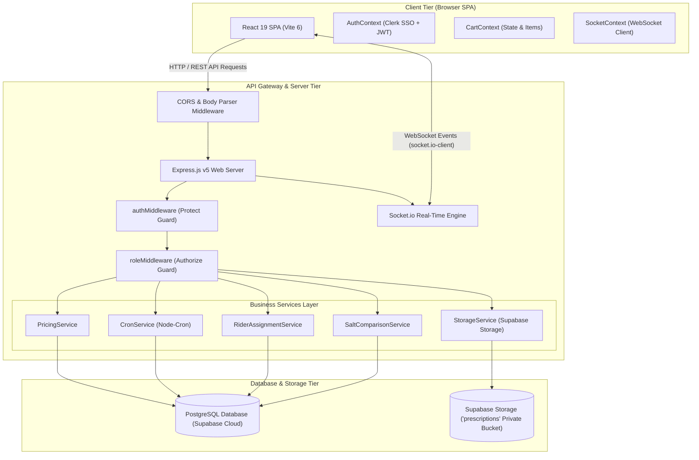
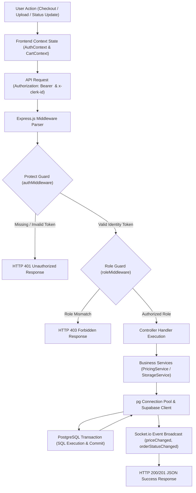
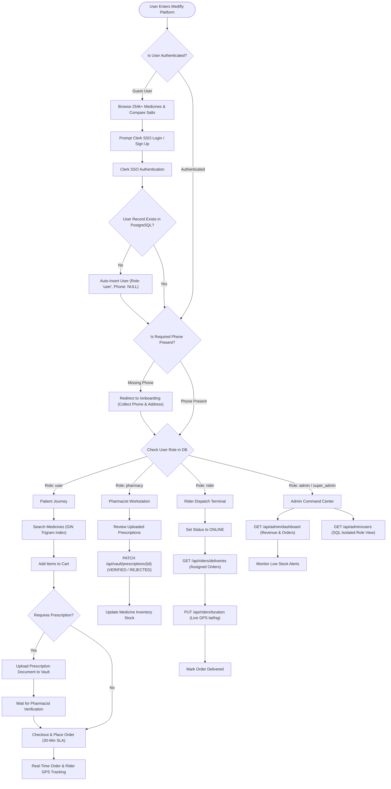
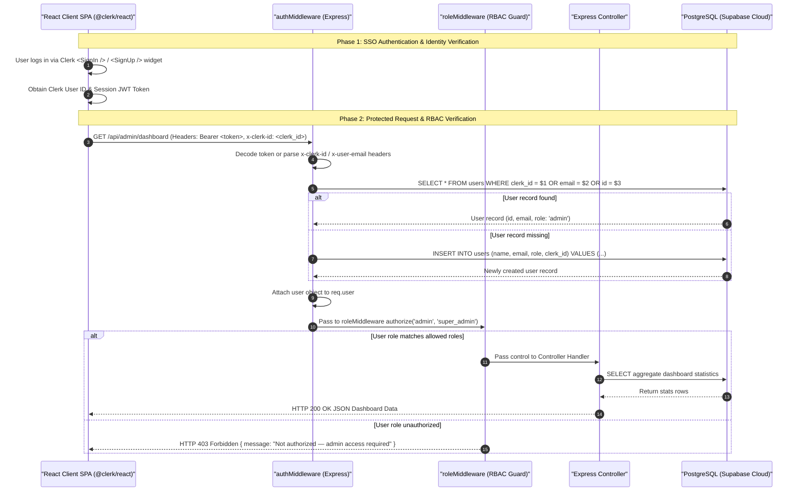

# 📑 Medifly — Interview Notes & Revision Guide

> **Document Purpose**: Senior Technical Lead & Candidate Interview Preparation Notebook for **Medifly** — Enterprise Emergency & Subscription Medicine Delivery Platform. Encoded in UTF-8.

---

## 📌 Executive Summary & 30-Second Elevator Pitch

> "**Medifly** is an enterprise-grade emergency healthcare delivery and automated prescription refill platform built using Node.js **Express v5**, **React 19**, **Vite 6**, **Clerk Authentication & Multi-Tenancy**, and **PostgreSQL (Supabase Cloud)**. Designed for high-concurrency real-time logistics, Medifly hosts over **254,023 authentic medicines** with `pg_trgm` GIN trigram indexing, a bioequivalent **Salt Comparison Engine** that automatically matches branded medications with cheaper generic alternatives (saving up to 70%), a **Prescription Vault** with family member profiles and server-side ownership security (`account_owner_id`), a **Multi-Tier Dynamic Pricing Engine** (`PricingService`) computing subscriber discounts, cold-chain handling, emergency surcharges, and late-night fees, and an automated **Cron Refill Engine** (`CronService`) managing recurring subscriptions. Medifly uses **Socket.io** for real-time inventory alerts, order status tracking, and fleet rider GPS updates, backed by Clerk multi-tenancy authentication, strict **Role-Based Access Control (RBAC)**, and 100% account data isolation."

---

## 🌐 Live URLs & Credentials

- **Live Production API**: [https://medifly-api.onrender.com](https://medifly-api.onrender.com)
- **Production Health Check**: `GET https://medifly-api.onrender.com/health`
- **GitHub Repository**: [https://github.com/em-srs/Medifly](https://github.com/em-srs/Medifly)

| Portal / Role | Email Address | Password | Key Scope |
| :--- | :--- | :--- | :--- |
| **Regular Patient (`user`)** | `user@medifly.com` | `user123` | Search 254k+ meds, Cart, 30-Min SLA, Family Vault, Orders, Refills |
| **Pharmacist (`pharmacy`)** | `pharma@medifly.com` | `pharma123` | Prescription Document Verification, Stock Updates |
| **Fleet Rider (`rider`)** | `rider@medifly.com` | `rider123` | Live GPS Updates (`lat`/`lng`), Active Order Deliveries |
| **System Admin (`admin`)** | `admin@medifly.com` | `admin123` | Revenue Analytics, System Overrides, Low-Stock Alerts |
| **Super Admin (`super_admin`)** | `superadmin@medifly.com`| `superadmin123`| Executive Governance, Super Admin User Management |

---

## 🏛️ Comprehensive Architecture & Diagrams

### 1. High-Level System Architecture



*Architectural Reasoning*: Decoupling the React 19 SPA from the Express v5 web server provides clean state isolation (`AuthContext`, `CartContext`, `SocketContext`), enabling rapid WebSocket event broadcasting without SSR hydration overhead.

---

### 2. System Data Flow Diagram



*Architectural Reasoning*: Enforcing dual-middleware authentication guards (`authMiddleware` followed by `roleMiddleware`) before invoking controller logic guarantees that unauthorized requests are rejected early at the middleware boundary.

---

### 3. User Flow & Journey Flowchart



*Architectural Reasoning*: Post-signup onboarding guarantees mandatory 10-digit phone collection before patient ordering, while custom role branching directs users to specialized workspaces.

---

### 4. JWT Authentication & RBAC Sequence Diagram



*Architectural Reasoning*: Auto-inserting first-time Clerk SSO users into PostgreSQL with `NULL` phone numbers prevents schema errors while ensuring complete role attribution.

---

### 5. Entity Relationship Diagram (ERD)


*Architectural Reasoning*: Relational normalization (`salts.id REFERENCES medicines.salt_id`) supports fast bioequivalent alternative queries, while price snapshotting inside `order_items.price` guarantees financial audit immutability.

---

## 💻 Frontend Deep-Dive

### Real Stack
- **Framework**: React 19 SPA + Vite 6
- **Routing**: React Router v7
- **Auth Provider**: `@clerk/react` v6 + `AuthContext`
- **State Management**: `CartContext`, `SocketContext` (WebSockets)
- **Styling**: Vanilla CSS Modules + HSL CSS variable architecture

### Component Tree Breakdown

| Component File | Primary Architectural Role |
| :--- | :--- |
| [`ProtectedRoute.jsx`](file:///d:/CODINGBRO/medifly%20mern/frontend/src/components/ProtectedRoute.jsx) | Client-side route guard handling auth checks, missing phone redirects to `/onboarding`, and RBAC role validation |
| [`Header.jsx`](file:///d:/CODINGBRO/medifly%20mern/frontend/src/components/Header.jsx) | Navigation bar with Clerk `<UserButton />`, active cart counter badge, live SLA indicators, and role-based links |
| [`CartSidebar.jsx`](file:///d:/CODINGBRO/medifly%20mern/frontend/src/components/CartSidebar.jsx) | Slide-out cart drawer computing subtotal, tax, delivery fee, subscriber discounts, and prescription requirement warnings |
| [`MedicineCard.jsx`](file:///d:/CODINGBRO/medifly%20mern/frontend/src/components/MedicineCard.jsx) | Medicine product card with dynamic dosage image resolver, salt comparison trigger, and stock availability badge |

### Key Code Snippets from Codebase

#### 1. Onboarding & Role Guard Clause (`ProtectedRoute.jsx`)
```javascript
// Excerpt from frontend/src/components/ProtectedRoute.jsx
const ProtectedRoute = ({ children, allowedRoles = [] }) => {
  const { user, isLoaded } = useUser();
  const { dbUser } = useAuth();

  if (!isLoaded) return <div className="loading-spinner">Loading...</div>;
  if (!user) return <Navigate to="/login" replace />;

  // Redirect to onboarding if phone is missing
  if (dbUser && !dbUser.phone && window.location.pathname !== '/onboarding') {
    return <Navigate to="/onboarding" replace />;
  }

  // RBAC Role Check
  if (allowedRoles.length > 0 && dbUser && !allowedRoles.includes(dbUser.role)) {
    return <Navigate to="/" replace />;
  }

  return children;
};
```

#### 2. Physical Appearance Asset Resolver (`getMedicineImage.js`)
```javascript
// Excerpt from frontend/src/utils/getMedicineImage.js
export const getMedicineImage = (dosageForm, isColdChain = false) => {
  if (isColdChain) return '/assets/medicines/cold-chain-insulin.png';
  const form = (dosageForm || '').toLowerCase();
  if (form.includes('tablet')) return '/assets/medicines/tablet-strip.png';
  if (form.includes('capsule')) return '/assets/medicines/capsule-blister.png';
  if (form.includes('syrup') || form.includes('liquid')) return '/assets/medicines/syrup-bottle.png';
  if (form.includes('injection')) return '/assets/medicines/injection-vial.png';
  if (form.includes('inhaler')) return '/assets/medicines/inhaler-device.png';
  return '/assets/medicines/generic-medicine.png';
};
```

---

## ⚙️ Backend Deep-Dive

### Real Stack
- **Web Framework**: Express v5.2.1 on Node.js
- **Database Client**: `pg` Pool (`Pool` from `pg` v8.23) on Supabase Cloud
- **Background Jobs**: `node-cron` v4.2
- **WebSockets**: `socket.io` v4.8
- **File Storage**: `@supabase/supabase-js` v2.112 (Private `prescriptions` bucket)

### Key Backend Services & Snippets

#### 1. Multi-Tier Dynamic SLA Pricing Engine (`pricingService.js`)
```javascript
// Excerpt from backend/services/pricingService.js
class PricingService {
  static calculateOrderPricing({ items, isSubscribed, isEmergency, isColdChain, orderHour }) {
    const itemsPrice = items.reduce((acc, item) => acc + (item.price * item.qty), 0);
    const taxPrice = Number((itemsPrice * 0.05).toFixed(2));
    
    // Subscriber Discounts
    const platformFee = isSubscribed ? 2.00 : 6.00;
    const deliveryFee = 30.00; // Flat 30-Min SLA Fee
    const coldChainFee = isColdChain ? (isSubscribed ? 15.00 : 25.00) : 0.00;
    const emergencyFee = isEmergency ? (isSubscribed ? 25.00 : 50.00) : 0.00;
    
    // Late Night Surcharge (10 PM to 6 AM)
    const isLateNight = orderHour >= 22 || orderHour < 6;
    const lateNightFee = isLateNight ? (isSubscribed ? 0.00 : 20.00) : 0.00;

    const totalPrice = Number((itemsPrice + taxPrice + platformFee + deliveryFee + coldChainFee + emergencyFee + lateNightFee).toFixed(2));
    
    return { itemsPrice, taxPrice, platformFee, deliveryFee, coldChainFee, emergencyFee, lateNightFee, totalPrice };
  }
}
```

#### 2. Auto-Refill Subscription Scanner (`cronService.js`)
```javascript
// Excerpt from backend/services/cronService.js
const startCronJobs = () => {
  // Midnight Cron Job: 0 0 * * *
  cron.schedule('0 0 * * *', async () => {
    try {
      const dueRes = await query(
        `SELECT s.*, u.is_subscribed 
         FROM subscriptions s
         JOIN users u ON s.user_id = u.id
         WHERE s.status = 'ACTIVE' AND s.next_delivery_date <= CURRENT_TIMESTAMP`
      );

      for (const sub of dueRes.rows) {
        // Auto-generate order & update next delivery date based on sub.frequency
      }
    } catch (err) {
      console.error('Cron job error:', err.message);
    }
  });
};
```

---

## 🔒 Security & Auth Deep-Dive

### 1. Clerk SSO & Token Scheme
- Authentication is handled via Clerk (`@clerk/react`). Front-end API requests attach JWT tokens in the `Authorization: Bearer <token>` header or provide `x-clerk-id` headers.
- `authMiddleware.js` extracts the user identifier, queries PostgreSQL (`SELECT * FROM users WHERE clerk_id = $1 OR email = $2 OR id = $3`), and auto-creates missing users with `NULL` phone numbers.

### 2. Dual-Tier RBAC & SQL Isolation
- **Role Enforcement**: `roleMiddleware.js` enforces role boundaries (`authorize('pharmacy', 'admin')`).
- **SQL Visibility Isolation**: `GET /api/admin/users` filters out `super_admin` records (`WHERE role != 'super_admin'`) when queried by a standard `admin`.

### 3. Server-Side Family Vault Security
- Family members are bound to `account_owner_id`. When querying member prescriptions (`GET /api/vault/members/:id/prescriptions`), the controller verifies server-side that `member.account_owner_id === req.user.id`.

---

## 📡 API Reference Recap

| Method | Endpoint | Protected? | Allowed Roles | Description |
| :--- | :--- | :--- | :--- | :--- |
| `POST` | `/api/auth/login` | No | Public | Authenticate user credentials & return JWT |
| `GET` | `/api/users/me` | Yes | All Authenticated | Fetch current logged-in PostgreSQL profile |
| `GET` | `/api/medicines` | No | Public | Search 254k+ medicines (`pg_trgm` GIN index) |
| `GET` | `/api/medicines/salt-comparison/:id`| No | Public | Compare bioequivalent generic alternatives |
| `POST` | `/api/orders` | Yes | `user` | Create order & calculate SLA delivery pricing |
| `GET` | `/api/vault/members` | Yes | `user` | List family member profiles |
| `POST` | `/api/vault/members/:id/prescriptions`| Yes | `user` | Upload prescription file to Supabase |
| `GET` | `/api/vault/prescriptions/:id/file` | Yes | `user`, `pharmacy`, `admin` | Stream 10-minute temporary signed file URL |
| `PUT` | `/api/prescriptions/:id/verify` | Yes | `pharmacy`, `admin` | Verify prescription document status |
| `POST` | `/api/subscriptions` | Yes | `user` | Create automated recurring refill plan |
| `PUT` | `/api/riders/location` | Yes | `rider` | Update live rider GPS coordinates |
| `GET` | `/api/admin/dashboard` | Yes | `admin`, `super_admin` | Platform analytics & revenue dashboard |

---

## 🎯 Technical Interview Q&A & Talking Points

### Question 1: Framework & Database Selection Rationale
**Q: Why choose Express.js v5 with Node.js and PostgreSQL (Supabase) over MongoDB or Next.js?**
> **Answer**: Express v5 on Node.js provides non-blocking, event-driven I/O ideal for real-time WebSocket communication via Socket.io. For a high-scale medicine catalog (254,023 items), PostgreSQL with `pg_trgm` GIN trigram indexing far outperforms MongoDB in structured relational queries, join performance, and transactional safety. A decoupled React 19 SPA served via Vite offers clean client-side state isolation (`AuthContext`, `CartContext`, `SocketContext`) without SSR hydration overhead.

### Question 2: Concurrency & Stock Depletion Guards
**Q: How does Medifly handle race conditions, simultaneous stock depletion, and inventory integrity during order creation?**
> **Answer**: During order placement (`POST /api/orders`), Medifly executes atomic inventory updates in PostgreSQL inside explicit SQL transactions:
> ```sql
> UPDATE medicines 
> SET inventory_count = inventory_count - $1 
> WHERE id = $2 AND inventory_count >= $1;
> ```
> By adding `AND inventory_count >= $1` directly inside the `UPDATE` statement, PostgreSQL guarantees thread-safe atomic decrements without race conditions. If the row count affected is 0, the transaction rolls back, returning an out-of-stock error. Furthermore, Socket.io broadcasts `inventoryChanged` events to instantly update connected browser clients.

### Question 3: Role-Based Access Control (RBAC) Enforcement
**Q: How is Role-Based Access Control enforced across both backend and frontend layers?**
> **Answer**: Medifly enforces a defense-in-depth security model:
> 1. **Backend Guard**: Protected Express endpoints chain `protect` with `authorize(...roles)` middleware.
> 2. **SQL Isolation**: For user management (`GET /api/admin/users`), `admin` users are restricted at the SQL layer (`WHERE role != 'super_admin'`) so they can never view or modify `super_admin` accounts.
> 3. **Frontend Guard**: `ProtectedRoute.jsx` checks `user.role` from `AuthContext` to restrict client-side page rendering and route navigation.

### Question 4: Schema Normalization & Design Choices
**Q: Why separate the `salts` table from `medicines`, and why snapshot prices inside `order_items`?**
> **Answer**: 
> - **Salt Normalization**: Brand-name medicines (`medicines`) reference `salts.id` via foreign key. This allows rapid bioequivalent generic alternative queries (`compareSalts`) sorted ascending by price (up to 70% cheaper).
> - **Price Snapshotting**: Catalog item prices fluctuate over time. Storing `price` directly inside `order_items` at order creation time preserves historical financial auditing integrity, ensuring past receipts remain accurate regardless of future catalog price edits.

### Question 5: Testing Strategy & Verification
**Q: How did you approach testing and data isolation verification?**
> **Answer**: Core business logic services (`PricingService`, `SaltComparisonService`, `RiderAssignmentService`) were written as pure functions decoupled from Express HTTP objects. Automated test scripts (`testCrossAccountIsolation.js` and `testVaultEndToEnd.js`) were executed against Supabase PostgreSQL, verifying 100% pass rates across 5 cross-account isolation checks and 6 storage vault end-to-end checks.

### Question 6: Price Snapshotting & Historical Integrity
**Q: How does price snapshotting or historical data preservation work in Medifly?**
> **Answer**: When an order is placed (`POST /api/orders`), the unit price of each item at that exact millisecond is snapshotted into `order_items.price`. Subsequent catalog updates via `PUT /api/medicines/:id/price` do not mutate past `order_items` records, preserving financial auditing accuracy.

### Question 7: Cloud Deployments & Infrastructure Setup
**Q: How are cloud deployments and environment variables managed in production?**
> **Answer**: The React SPA is built via Vite (`npm run build`) and deployed to Vercel/Netlify. The Express backend is hosted on Render as a Node.js process with WebSocket support enabled, pinged every 5 minutes at `GET /health` by UptimeRobot to eliminate 15-minute inactivity spin-downs. Database and file storage are hosted on Supabase Cloud (PostgreSQL with `pg_trgm` GIN indexing and private storage buckets).
